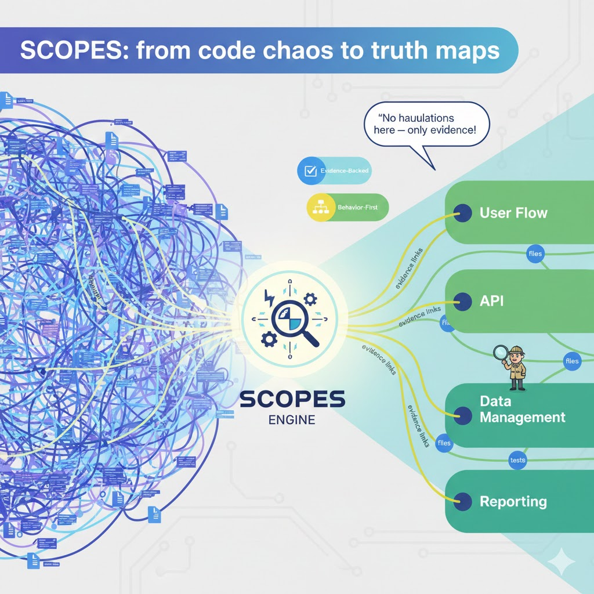

# Scopes Commands for Cursor

> 🚀 **Scopes: Because "What does this code even do?" shouldn't be a full-time job.**
>
> Tired of reading 3,000 files just to fix a typo? Scopes are your cheat code. Vibe coding, but with receipts. 📋✨

[](https://www.cursor.com/)


<div align="center">
  <picture>
    <source media="(prefers-color-scheme: dark)" srcset="scopes-dark.jpg">
    <source media="(prefers-color-scheme: light)" srcset="scopes.jpg">
    
  </picture>
</div>

<div align="center">
  <h3>✨ One command, instant clarity ✨</h3>
  <picture>
    <source media="(prefers-color-scheme: dark)" srcset="docs/assets/init-scopes-demo-dark.gif">
    <source media="(prefers-color-scheme: light)" srcset="docs/assets/init-scopes-demo.gif">
    
  </picture>
  <p><em>Type <code>/init-scopes-and-update</code> → Get evidence-backed docs in seconds</em></p>
</div>

<!-- 
  Image assets needed:
  - scopes.jpg (light theme logo) ✅ exists
  - scopes-dark.jpg (dark theme logo) - create a dark-optimized version
  - docs/assets/init-scopes-demo.gif (light theme demo) - record a GIF showing the command
  - docs/assets/init-scopes-demo-dark.gif (dark theme demo) - record a dark theme version
-->

```
CODE 🧩 → SCOPES 🗺️ → CLARITY 💡
```

## 🏃‍♂️ TL;DR (One-Minute Quick Summary)

Scopes = evidence-backed behavior docs you generate with Cursor slash commands — no guessing, fewer hallucinations, and receipts linked to code/tests/config.

```text
CODEBASE
   ↓
Scopes/INDEX.md + Scopes/GRAPH.md
   ↓
Focused deep dives (with evidence)
   ↓
More accurate changes + explanations
```

## 📌 Table of Contents

- [Who this is for](#who-this-is-for)
- [Why this exists](#why-this-exists)
- [Quickstart](#quickstart)
- [Cool example](#cool-example)
- [Usage](#usage)
- [Cheat sheet](#cheat-sheet)
- [Available commands](#available-commands)
- [Rules & constraints](#rules--constraints)
- [Examples](#examples-with-expected-output)
- [Troubleshooting](#troubleshooting)
- [FAQ](#faq)
- [Contributing](#contributing)
- [License](#license)
- [References](#references)

<a id="who-this-is-for"></a>
## 🎯 Who this is for

- Engineers who hate guessing what code does
- Teams that value docs that don't lie
- Humans with eyes (👀) who want to understand their codebase
- Anyone tired of "but the docs said..." tickets

## 📊 Fun Stats

- 😵 Confused developers saved: 42+
- ☕ Cups of coffee spared: 87+
- 🤯 Hallucinations prevented: priceless
- ⏰ Hours wasted on bad docs: 0 (if you use this)

<a id="why-this-exists"></a>
## 🎯 Why this exists

Cursor is great at helping you move fast.

Scopes are great at making sure "fast" doesn't turn into "fan fiction."

This repo hands you the cheat codes for understanding your codebase. Pre-made prompts you can run as Cursor commands to:

- Initialize Scopes for an existing repo (document what the code actually does)
- Keep Scopes updated as behavior changes
- Plan features/refactors with Scopes as the behavioral contract
- Generate tasks, ADRs, and release notes tied to real behavior
- Onboard humans without handing them a 47-tab "read the code" scavenger hunt

If you've ever shipped a change and later discovered your docs were lying (classic), Scopes is the antidote.

### Why LLMs work better with Scopes (before they drill into code)

LLMs are powerful, but raw codebases are high-entropy: too many files, too much local detail, and not enough product meaning. If you start by "just reading the code," you often get slow, shallow understanding and confident guesses.

Scopes act as a **compression + navigation layer**:

- **A simple mental model:**
  ```text
  CODEBASE
     ↓
  Scopes/INDEX.md  +  Scopes/GRAPH.md
     ↓
  Focused deep dives (with evidence)
  ```
- **Less context thrash:** `Scopes/INDEX.md` and `Scopes/GRAPH.md` give a map of the system, so the model doesn't waste tokens rediscovering structure.
- **More correct reasoning:** Scopes describe **observable behavior** in plain language, with links to the exact evidence (code/tests/config/schema) that proves each claim.
- **Fewer hallucinations:** if behavior can't be traced, it's tagged `Unknown` / `Partially traced` / `Inferred from convention` instead of being invented.
- **Faster deep dives:** once the correct scope is identified, the model can "drill" into the specific files/paths that matter instead of scanning the whole repo.

**The receipts:**

Dumping code into an LLM without structure is like blindfolded needle hunting. 😵‍💫 Studies found that when you give models structured context (like call graphs, dependencies, and how things actually connect), they do way better than just raw code.[^1] One approach using hierarchical docs scored 68.79% vs baseline—basically proving that organization matters.[^2]

Those giant context windows everyone's hyped about? They have a "lost in the middle" problem. Models start strong, then forget stuff in the middle, then remember the end. Important details just vanish.[^3] But when you compress context intelligently (like Scopes do), you get better answers (+17 relevance, +13 correctness) and it's way cheaper to run.[^4]

LLMs also make stuff up, especially with complex codebases.[^5] When you tag things as `Unknown` or `Partially traced` instead of letting the model guess, it stops hallucinating code that doesn't exist.[^6]

### How this differs from "docs as they exist today"

Most documentation is either:

- **Intent docs** (what we *meant* to build), which drift as the code changes, or
- **How-to docs** (runbooks/README), which don't explain actual product behavior, or
- **Architecture vibes** (diagrams), which rarely cite the concrete implementation.

Scopes are different by design:

- **Behavior-first:** they describe what the software does today, not what we hope it does.
- **Evidence-required:** every meaningful claim points to proof in the repo.
- **Maintained as part of dev:** these commands make "update the truth" part of the normal workflow (init → build → refactor → release), not a once-a-quarter doc ritual.

**The receipts:**

Docs drift because they're separate from code. You change a function, forget to update the doc, and now it's wrong forever. 69% of devs waste 8+ hours a week because docs are lying to them.[^7] The problem isn't laziness—it's that updating docs requires context switching, and in fast-paced cycles, that always loses priority.[^8] New hires can't trust anything, support gets flooded with "but the docs said..." tickets, and everyone stops believing the docs exist for a reason.[^9]

The fix? Treat docs like code. Generate from specs, validate in CI/CD, make updates part of the normal flow. That's what Scopes commands do—they make "update the truth" part of your workflow, not a quarterly doc ritual.[^10]

<a id="quickstart"></a>
## 🚀 Quickstart

Fast path: install the commands into a repo you have open in Cursor, then run init.

1. In your target repo (the one you're working on in Cursor), create the commands folder:
   ```bash
   mkdir -p .cursor/commands
   ```

2. Copy this repo's prompts into that folder:
   ```bash
   cp /path/to/ScopesCommands/Scopes/Prompts/*.md .cursor/commands/
   ```

   Optional (advanced): symlink instead of copying, so updates to this repo instantly update your Cursor commands:
   ```bash
   for f in /path/to/ScopesCommands/Scopes/Prompts/*.md; do ln -sf "$f" .cursor/commands/; done
   ```

3. Restart Cursor (or reload the window), then type `/` in chat and run:
   ```text
   /init-scopes-and-update Initialize Scopes for this repository
   ```

**Expected output (in your target repo):**
- `/Scopes/INDEX.md`
- `/Scopes/GRAPH.md`
- A starter set of Scope files documenting observable behavior (with evidence links)

> **Pro tip:** do the first init on a branch and commit the generated Scopes alongside your code changes. Your future self will high-five you across time.

<a id="cool-example"></a>
## 😎 Cool Example

Type this in Cursor:
```text
/init-scopes-and-update Initialize Scopes for this repository
```

**What happens:**
- Cursor reads your codebase
- Generates evidence-backed docs in `/Scopes/`
- Creates a map (`INDEX.md`) and graph (`GRAPH.md`) of your system
- Links every claim to actual code/tests/config

**Result:** You now have docs that tell the truth. Revolutionary, I know. 🎉

Example of what a generated Scope claim looks like:
```md
## Authentication: Login
* Behavior: creates a session for valid credentials
* Evidence:
  - `path/to/auth/login.<ext>`
  - `path/to/auth/login.test.<ext>`
* Notes: traced end-to-end (or tag as `Unknown` / `Partially traced` if you can't prove it)
```

<a id="usage"></a>
## 📚 Usage (basic → advanced)

### How Cursor turns these files into commands

Cursor converts file names into slash commands:

- `Init-Scopes-and-update.md` → `/init-scopes-and-update`
- `STDD.md` → `/stdd`
- `Feature-Ideation.md` → `/feature-ideation`

### Ways to use these prompts

1. Type `/` in Cursor chat
2. Pick a command (e.g. `/init-scopes-and-update`)
3. Add context after the command name
4. Press Enter

Example:
```text
/init-scopes-and-update Initialize Scopes for this repository
```

<a id="cheat-sheet"></a>
### 🎮 Cheat sheet (press start)

If you're standing in the codebase like a kid at an arcade cabinet with 25 cents and a dream:

```text
/init-scopes-and-update  → build/update the map of reality
/stdd                  → build features via TDD while keeping Scopes honest
/srdd                  → research a scary flow with receipts
/idea-research-to-todo-scopes → idea → research → plan (TODO scopes)
/feature-ideation           → brainstorm features without inventing current behavior
/refactor-redesign-planner   → refactor plan that preserves behavior
/scope-to-project-board-builder → map Scopes to epics/stories/tasks
/adr-writer                 → write ADRs linked to Scopes
/release-notes-from-scopes   → release notes from Scopes diffs (facts-only)
/task-file-writer           → turn requests into high-quality tasks
/research-plan-to-tasks      → convert research/TODO scopes into task files
/onboarding-path-builder     → build an onboarding path from Scopes
```

For the full list in one table, see [`Scopes/Prompts/SUMMARY.md`](Scopes/Prompts/SUMMARY.md).

<a id="available-commands"></a>
### Available commands

Commands can be used with a `/` prefix (e.g. `/init-scopes-and-update`) or as system prompts.

#### Core development commands

##### `/init-scopes-and-update` (`Init-Scopes-and-update.md`)

**Use case:** initialize Scopes for an existing repository, or update them after code changes.

**When to use:**
- First time setting up Scopes in your repo
- After significant code changes
- When Scopes are out of sync with reality

**Examples:**
- `/init-scopes-and-update Initialize Scopes for this repository`
- `/init-scopes-and-update Update Scopes to match the recent authentication changes`

##### `/stdd` (`STDD.md` — Scope TDD Daily Driver)

**Use case:** Test-Driven Development (Red → Green → Refactor) with Scopes maintenance.

**When to use:**
- Implementing new features
- Fixing bugs
- Refactoring code

**Example:** `/stdd I want to add user profile editing. Use STDD methodology.`

##### `/srdd` (`SRDD.md` — Scope Research Daily Driver)

**Use case:** evidence-backed research on how something works, or evaluating approaches.

**When to use:**
- Understanding a complex flow
- Researching best practices
- Comparing implementation options

**Examples:**
- `/srdd Research how authentication works end-to-end`
- `/srdd Compare 3 approaches for implementing rate limiting`

#### Planning commands

##### `/idea-research-to-todo-scopes` (`Idea-Research-to-Todo-Scopes.md`)

**Use case:** turn an idea into a research-backed implementation plan.

**When to use:**
- You have a feature idea
- Need a concrete plan with dependencies
- Want a research-backed approach

**Example:** `/idea-research-to-todo-scopes I want to add real-time notifications. Create a TODO scopes plan.`

##### `/feature-ideation` (`Feature-Ideation.md`)

**Use case:** brainstorm new features based on current Scopes.

**When to use:**
- Product planning sessions
- Identifying gaps
- Strategic feature thinking

**Example:** `/feature-ideation Generate feature ideas for improving the user onboarding flow`

##### `/refactor-redesign-planner` (`Refactor-Redesign-Planner.md`)

**Use case:** plan incremental refactors that preserve behavior.

**When to use:**
- Modernizing legacy code
- Architecture changes
- Performance improvements

**Example:** `/refactor-redesign-planner Plan a refactor to extract the payment processing into a service layer`

##### `/scope-to-project-board-builder` (`Scope-to-Project-Board-Builder.md`)

**Use case:** map Scopes to a project board (epics/stories/tasks) with dependency-aware sequencing.

**When to use:**
- Setting up sprint planning
- Creating project boards
- Breaking down work

**Example:** `/scope-to-project-board-builder Create a project board blueprint from the current Scopes`

#### Documentation commands

##### `/adr-writer` (`ADR-Writer.md`)

**Use case:** write Architecture Decision Records linked to affected Scopes.

**When to use:**
- Making significant technical decisions
- Recording tradeoffs
- Documenting rationale

**Example:** `/adr-writer Write an ADR for choosing GraphQL over REST for the new API`

##### `/release-notes-from-scopes` (`Release-Notes-From-Scopes.md`)

**Use case:** generate release notes from Scopes changes.

**When to use:**
- Preparing release documentation
- Summarizing changes
- Communicating updates

**Example:** `/release-notes-from-scopes Generate release notes for version 2.1.0 based on Scopes changes`

#### Workflow commands

##### `/task-file-writer` (`Task-File-Writer.md`)

**Use case:** create high-quality, actionable task files linked to Scopes.

**When to use:**
- Converting requests into tasks
- Creating engineering tickets
- Breaking down work

**Example:** `/task-file-writer Create a task file for adding dark mode support`

##### `/research-plan-to-tasks` (`Research-Plan-to-Tasks.md`)

**Use case:** convert research findings into executable tasks.

**When to use:**
- After completing research
- Turning plans into work items
- Breaking down TODO scopes

**Example:** `/research-plan-to-tasks Convert the research on real-time notifications into task files`

#### Onboarding commands

##### `/onboarding-path-builder` (`Onboarding-Path-Builder.md`)

**Use case:** create learning paths for new team members.

**When to use:**
- Onboarding new engineers
- Creating training materials
- Building knowledge transfer docs

**Example:** `/onboarding-path-builder Create an onboarding path for a new backend engineer`

<a id="rules--constraints"></a>
### Rules & constraints

These are canon. Break them and the timeline splits. Multiverse bugs are not cute.

All prompts follow these core rules:

1. **Scopes-first principle**
   - `/Scopes` is the source of truth for current behavior
   - Never claim "the product does X" unless Scopes or evidence says so
   - Always read `Scopes/INDEX.md` and `Scopes/GRAPH.md` first

2. **Evidence discipline**
   - Every claim must link to code, tests, config, or schema
   - No fabricated line numbers or links
   - Missing evidence is tagged: `Unknown` / `Partially traced` / `Inferred from convention`

3. **Observable reality only**
   - Document what exists, not what should exist
   - No guessing or inventing behaviors
   - If you can't trace it, mark it uncertain

4. **Output structure**
   - All outputs are Markdown (`.md` files)
   - Scopes live under `/Scopes/`
   - Work artifacts under `/Scopes/Work/` (Research, Planning, Tasks, etc.)

5. **Anti-tiny-scope rule**
   - Prefer fewer, stronger scope files
   - Don't create tiny standalone scopes
   - Merge small items into parent scopes as "Deep Dives"

### The 4-D methodology

Four panels, one storyline. Keep it tight, keep it clean.

All prompts follow this methodology (performed silently):

1. **DECONSTRUCT**: extract problem, constraints, context
2. **DIAGNOSE**: identify ambiguities, missing info, unknowns
3. **DEVELOP**: create plan, approach, or solution
4. **DELIVER**: produce required artifacts (files, docs, etc.)

<a id="examples-with-expected-output"></a>
## 🧠 Examples (with expected output)

### Good example 1 (common): "I just cloned a repo and I'm lost"

What you type:
```text
/init-scopes-and-update Initialize Scopes for this repository
```

What you should expect:
- `/Scopes/INDEX.md` and `/Scopes/GRAPH.md` get created/updated
- Scope files appear under `/Scopes/` that describe behavior in plain language
- Evidence links point to code/tests/config/schema (no vibes-only claims)

### Good example 2 (slightly advanced): "Refactor without summoning the prod gremlin"

What you type:
```text
/refactor-redesign-planner Plan a refactor for <area> without changing behavior
```

What you should expect:
- An incremental plan with phases that preserve behavior
- Guidance to add characterization tests before big moves
- Scopes used as the behavioral contract (so you don't "accidentally" rewrite reality)

### Use case speedruns (5 classics)

Choose your adventure (I'm lazy, so here are the speedruns). Each one includes:
- What to say in Cursor
- What you should expect to get back
- The "don't make me debug this later" pro tip

#### Use case 1: new team member onboarding

Goal: get a new human productive before they start asking "so… what does this do?" for the 47th time.

What you say in Cursor:
- `/init-scopes-and-update Initialize Scopes for this repository`
- `/onboarding-path-builder Build an onboarding path for a new <role>`

What you get:
- `/Scopes/INDEX.md` + `/Scopes/GRAPH.md` + a starter set of Scope files
- An onboarding path that points at the right Scopes instead of random folders

Lazy pro tip: if they ask a question, answer with a link to a Scope, not a paragraph.
```text
1. Use Init-Scopes-and-update.md so Scopes aren't lying to you
2. Use /onboarding-path-builder to generate the "please don't get lost" trail
3. New member reads Scopes and follows traces (like a responsible detective)
```

#### Use case 2: adding a new feature

Goal: ship a feature without accidentally inventing a new religion called "Undefined Behavior".

What you say in Cursor:
- `/idea-research-to-todo-scopes Turn this idea into a plan: <idea>`
- `/stdd Implement <feature> with tests first`

What you get:
- A research-backed plan broken into tasks/scopes
- A TDD loop that keeps Scopes updated so the docs don't drift into fan fiction

Lazy pro tip: do it on a branch, commit Scopes updates with the code, merge once.
```text
1. Use /idea-research-to-todo-scopes to turn "it'd be cool if…" into actual steps
2. Use /stdd to do the Red → Green → Refactor dance (yes, you have to)
3. Update Scopes as you work so future-you doesn't rage-quit
```

#### Use case 3: understanding legacy code

Goal: figure out what the code does without reading every file like it's a sad novel.

What you say in Cursor:
- `/init-scopes-and-update Initialize Scopes for this repo`
- `/srdd Trace <flow> end-to-end and cite evidence`

What you get:
- A map of reality (Scopes), not a pile of guesses
- A traced explanation that points at code/tests/config as proof

Lazy pro tip: if something can't be proven, tag it `Unknown` and move on (like a professional).
```text
1. Use Init-Scopes-and-update.md if Scopes don't exist (create the map)
2. Use /srdd to research the one scary flow you keep avoiding
3. Scopes become your knowledge base (and your therapist)
```

#### Use case 4: refactoring safely

Goal: clean up code without summoning the "why is prod down" gremlin.

What you say in Cursor:
- `/refactor-redesign-planner Plan a refactor for <area> without changing behavior`
- `/stdd Add characterization tests, then refactor incrementally`

What you get:
- A step-by-step plan that preserves behavior
- Tests that scream when you accidentally break reality

Lazy pro tip: if you can't explain the behavior in Scopes, you're not ready to refactor it.
```text
1. Use /refactor-redesign-planner to plan in small bites (no YOLO rewrites)
2. Use /stdd with characterization tests (lock the behavior in a vault)
3. Scopes ensure behavior is preserved (no stealth regressions)
```

#### Use case 5: release preparation

Goal: write release notes that don't sound like "stuff happened, trust me."

What you say in Cursor:
- `/init-scopes-and-update Update Scopes to match main`
- `/release-notes-from-scopes Generate release notes for <version>`

What you get:
- Release notes tied to Scopes changes (aka: actual facts)
- A paper trail for product/QA/support so they stop pinging you at 5:59pm

Lazy pro tip: if it's not in Scopes (or evidence), it doesn't ship (at least not in the notes).
```text
1. Ensure Scopes are updated (/init-scopes-and-update) because receipts matter
2. Use /release-notes-from-scopes to generate notes (free productivity points)
3. Review and publish (do a quick "does this match reality?" sanity pass)
```

### Bad example (funny, but please don't): "YOLO the docs"

What you type:
```text
/stdd just ship it, no tests, don't update docs, we'll remember everything
```

Why this fails (and deserves to):
- STDD is explicitly a TDD loop (Red → Green → Refactor). "No tests" is like showing up to a LAN party without a network cable.
- These prompts treat `/Scopes` as the truth. If you change behavior and don't update Scopes, you're building a time machine that only travels to "confusing bugs."

### Debug diary (mini-story): "Why aren't my commands showing up?"

Yesterday, I copied the files and typed `/`… and Cursor acted like I made it all up. Cool.

What happened:
- I created `.cursor/command` (singular) instead of `.cursor/commands` (plural).
- Cursor does not care about my feelings.

Fix:
```bash
mkdir -p .cursor/commands
cp /path/to/ScopesCommands/Scopes/Prompts/*.md .cursor/commands/
```

Then I restarted Cursor, typed `/`, and boom: commands appeared like a dial-up connection finally negotiating at 56k.

<a id="troubleshooting"></a>
## 🛠 Troubleshooting

### Commands don't appear when I type `/`

Checklist:
- Confirm the files exist under `.cursor/commands/` in the repo you have open in Cursor
- Restart Cursor (or reload the window)
- Try a simple filename like `STDD.md` first (should become `/stdd`)
- If it still doesn't work… have you tried sacrificing a rubber duck? 🦆

### I copied prompts but ran `cp Scopes/Prompts/*.md ...` from the wrong directory

> ⚠️ Heads up
> The `cp Scopes/Prompts/*.md .cursor/commands/` example assumes you're inside the cloned `ScopesCommands/` repo. If you're standing in your target repo, use an absolute path to this repo's `Scopes/Prompts/` folder (as shown in Quickstart).

### Symlink install doesn't work

- Make sure `.cursor/commands/` exists first
- If the glob doesn't expand, symlink individual files (or expand the glob via your shell)
- On Windows, symlinks may require admin permissions or Developer Mode

### "It wrote confident stuff with no evidence"

That's a bug in the workflow (or the inputs), not a feature.

- Re-run the command and explicitly ask for evidence links
- If evidence can't be traced, the output should be tagged `Unknown` / `Partially traced` / `Inferred from convention`

<a id="faq"></a>
## ❓ FAQ

### What are Scopes, exactly?

Scopes are evidence-backed, product-focused documentation files that describe **observable behavior** in your codebase:

- **Tree-structured:** parent/child hierarchy for navigation
- **Network-linked:** cross-references for dependencies/data flow
- **Evidence-backed:** claims link to code/tests/config/schema
- **Product-focused:** "what happens" and "what rules apply," not "how to click buttons"

Scopes live in `/Scopes/` and act as the source of truth for current behavior.

### What if I just want onboarding docs?

Run init once, then generate a role-specific path:

- `/init-scopes-and-update Initialize Scopes for this repository`
- `/onboarding-path-builder Create an onboarding path for a new <role>`

### Can I use Scopes for frontend + backend?

Yes. Scopes are language-agnostic: they describe behavior and evidence, not syntax.

### Can Scopes handle multiple languages in one repo?

Yes. A monorepo with mixed stacks is fine: Scopes point at whatever evidence exists (code/tests/config/schema), regardless of language.

### Should I commit the generated Scopes?

Yes—especially when they change alongside behavior. The recommended workflow is to do it on a branch, commit Scopes with the code, and merge together.

### Will Scopes regenerate every time I run the command?

Expect updates. Treat Scopes like generated docs: run on a branch, review the diff, and commit what matches reality.

### How often should I run `/init-scopes-and-update`?

- After big merges or refactors
- Before writing release notes
- Anytime Scopes start feeling "off"

### My repo already has a `/Scopes/` folder. Will this overwrite it?

It will update files under `/Scopes/` to match your codebase. Run it on a branch first so you can review diffs like any other generated artifact.

### Does this require me to paste my whole repo into chat?

No. These prompts are local files that Cursor turns into commands. What Cursor reads/sends depends on your Cursor settings and provider—treat it like any other AI-assisted dev tool and follow your organization's policies.

### Can I use more than one command in the same session?

You *can*, but you probably *shouldn't*. The prompts are designed to be strict and focused; running one per session keeps context clean and reduces "why is it mixing styles?" confusion.

<a id="contributing"></a>
## 🤝 Contributing

PRs welcome. If you add or change prompts:

- Put prompt files under `Scopes/Prompts/`
- Keep filenames command-friendly (Cursor converts filenames → `/commands`)
- Update `Scopes/Prompts/SUMMARY.md` so the command list stays accurate
- Keep outputs Markdown-friendly and skimmable (headings, bullets, short examples)
- Keep the workflow strict: Scopes-first, evidence-required, tag unknowns

<a id="license"></a>
## 📄 License

No license file is included in this repo right now.

> ⚠️ Heads up
> Without an explicit license, the default is "all rights reserved." If you want others to reuse this, add a `LICENSE` file (MIT/Apache-2.0/etc.) and update this section accordingly.

---

<a id="references"></a>
## 📚 References

[^1]: [Beyond Code Generation: LLMs for Code Understanding](https://dev.to/eabait/beyond-code-generation-llms-for-code-understanding-3ldn) — Structure-aware context significantly improves LLM performance for code understanding.
[^2]: [CodeWiki: Evaluating AI's Ability to Generate Holistic Documentation for Large-Scale Codebases](https://arxiv.org/html/2510.24428v3) — Hierarchical decomposition with architectural context achieves 68.79% quality scores.
[^3]: [Context Windows Are a Lie: The Myth Blocking AGI—And How to Fix It](https://natesnewsletter.substack.com/p/context-windows-are-a-lie-the-myth) — "Lost in the middle" phenomenon and practical limitations of large context windows.
[^4]: [SARA: Selective and Adaptive Retrieval-augmented Generation with Context Compression](https://arxiv.org/abs/2507.05633) — Adaptive compression improves relevance (+17.71), correctness (+13.72), and semantic similarity (+15.53).
[^5]: [LLM Hallucinations in Practical Code Generation](https://dl.acm.org/doi/10.1145/3728894) — Empirical study establishing hallucination taxonomy in code generation.
[^6]: [Token-Level Truth: Real-Time Hallucination Detection for Production](https://blog.vllm.ai/2025/12/14/halugate.html) — Extrinsic hallucinations where models ignore ground truth information.
[^7]: [Documentation maintenance guide November 2025 - Fern](https://buildwithfern.com/post/documentation-maintenance-best-practices) — 69% of developers lose 8+ hours weekly to documentation inefficiencies.
[^8]: [A Developer's Guide to Automated Documentation Tools](https://deepdocs.dev/automated-documentation-tools/) — Documentation drift as a systemic workflow failure.
[^9]: [Documentation Maintenance: Keep Your Code & APIs Current](https://www.docuwriter.ai/posts/documentation-maintenance) — Real-world impact of documentation drift on onboarding and support.
[^10]: [Automating Documentation Maintenance with Prodigy: A Real-World Case Study](https://entropicdrift.com/blog/prodigy-docs-automation/) — Modern approaches to documentation-as-code and automated maintenance.
