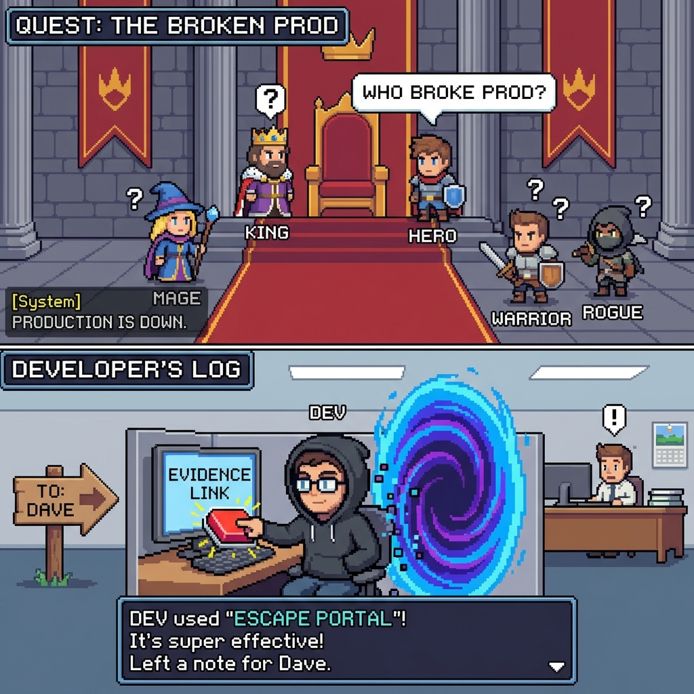

# Scopes Commands for Cursor

> **Scopes: Because "What does this code even do?" shouldn't be a full-time job.**
>
> Evidence-backed docs + workflows, packaged as Cursor slash commands.

[](https://www.cursor.com/)


<p align="center">
  
</p>

## Visualizing the Problem (and the Solution)

| **The Reality** | **The Fix** |
| :---: | :---: |
|  <br> *What your codebase actually looks like.* |  <br> *Turning the chaos into organized beams of truth.* |

| **The Goal** | **The Vibe** |
| :---: | :---: |
|  <br> *Certified working code.* |  <br> *Deploying on Friday? No sweat.* |


```
CODE 🧩 → SCOPES 🗺️ → CLARITY 💡
```

## TL;DR
Scopes are **behavior docs with receipts** (links into code/tests/config). This repo provides a set of Cursor commands that help you:

- Create/maintain Scopes (your map of the system)
- Turn ideas/research into plans/tasks
- Execute changes via a strict workflow while keeping Scopes honest

Key files:
- `Scopes/INDEX.md`: the map (tree)
- `Scopes/GRAPH.md`: the relationships (graph)
- `Scopes/Product/**`: capability truth (what the product does today)

## Quickstart

Install these prompts into the repo you have open in Cursor:

1) Create the commands folder:

```bash
mkdir -p .cursor/commands
```

2) Copy (or symlink) this repo’s prompts:

```bash
cp /path/to/ScopesCommands/Scopes/Prompts/*.md .cursor/commands/
```

Optional (advanced): symlink so updates follow automatically:

```bash
for f in /path/to/ScopesCommands/Scopes/Prompts/*.md; do ln -sf "$f" .cursor/commands/; done
```

3) Restart Cursor (or reload window), then type `/` and pick a command.

## Demo


## The Prime Command: `/sync-scopes`

`/sync-scopes` is the heartbeat of this entire methodology. It is an agentic command that acts as a **Project Scope Archivist**.

**What it does:**
1.  **Audits your entire codebase** (code, tests, config).
2.  **Generates "Source of Truth" docs** inside `Scopes/Product/`.
3.  **Cross-links everything** into a knowledge graph (`Scopes/GRAPH.md`).

**When to use it:**
- **Onboarding**: Run it on a legacy code base to get an instant map (`Generation Mode`).
- **Maintenance**: Run it after shipping a feature to keep docs true (`Update Mode`).

---

## The Commands (current)
Cursor turns filenames into slash commands (e.g. `dev-loop.md` → `/dev-loop`).

These are the commands in `Scopes/Prompts/`:

| Command | File | What it does |
|---|---|---|
| `/dev-loop` | `Scopes/Prompts/dev-loop.md` | Implement a feature/bug via strict TDD and update Scopes as you go |
| `/bug-hunt` | `Scopes/Prompts/bug-hunt.md` | Find bugs/anti-patterns with evidence; output a bug report (and optional tasks) |
| `/write-tasks` | `Scopes/Prompts/write-tasks.md` | Turn intent/plans/research/bugs into 1–4 hour engineer-ready tasks |
| `/plan-idea` | `Scopes/Prompts/plan-idea.md` | Turn an idea into a sequenced plan (and create/reuse research if needed) |
| `/ideate` | `Scopes/Prompts/ideate.md` | Generate scope-anchored ideas that are ready to plan |
| `/plan-board` | `Scopes/Prompts/plan-board.md` | Turn `Scopes/` into an execution board blueprint |
| `/sync-scopes` | `Scopes/Prompts/sync-scopes.md` | **The Core Agent**. Generates/updates Scopes (truth) from code. Run this to map the system or after large changes. |
| `/plan-refactor` | `Scopes/Prompts/plan-refactor.md` | Plan a safe refactor with verification gates and scope maintenance |
| `/research-loop` | `Scopes/Prompts/research-loop.md` | Research with strict internal-vs-external truth separation |
| `/write-adr` | `Scopes/Prompts/write-adr.md` | Write ADRs linked to affected scopes (and graph implications) |
| `/write-release` | `Scopes/Prompts/write-release.md` | Release notes from scope delta (facts-only) |
| `/write-onboarding` | `Scopes/Prompts/write-onboarding.md` | Role-based onboarding path driven by scope traces |

Notes:
- For prompt standards and the full list, see `Scopes/Prompts/README.md`.

## Recommended workflows (how commands connect)

<p align="center">
  
  <br>
  <em>Stop asking "Who broke prod?" and start fixing it.</em>
</p>

- **Fix a bug**: `/bug-hunt` → `/write-tasks` → `/dev-loop`
- **Ship a feature**: `/ideate` → `/plan-idea` → `/write-tasks` → `/dev-loop`
- **Make a decision**: `/research-loop` → `/write-adr` → `/plan-idea` (or `/write-tasks`)
- **Prepare a release**: ensure `Scopes/Product/**` is up to date → `/write-release`
- **Onboard someone**: ensure “backbone” scopes exist → `/write-onboarding`

## Docs
- **Prompts / commands**: `Scopes/Prompts/README.md`
- **Template + audit protocol**: `Scopes/Prompts/sync-scopes.md`
- **Background / why this works**: `docs/why-scopes.md`

## Contributing
PRs welcome. If you add/change prompts:
- Keep them in `Scopes/Prompts/`
- Keep filenames command-friendly
- Update `Scopes/Prompts/README.md`

## License

This project is licensed under the MIT License - see the [LICENSE](LICENSE) file for details.
