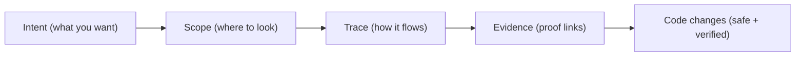

# Scopes: Evidence‑Backed AI Skills for Real Codebases

**Stop pasting folders. Stop guessing. Start shipping with proof.**

Scopes is a set of **skills** and **agents** that turns your repo into a map your AI assistant can reliably navigate. It adds an opinionated, evidence-backed layer ("Scopes") that translates **human intent** (features, capabilities, flows) into **code truth** (exact files + line ranges, tests, config, schemas).

If you've ever watched an assistant "sound confident" while looking in the wrong place, this is the fix.


## Who this is for

- Engineers using AI assistants on real repos (not toy projects)
- Teams that care about correctness, maintainability, and repeatable workflows
- Anyone tired of paying tokens to brute-force "context"

---

## The problem Scopes solves

When a developer asks an AI assistant to *"update the login flow"* or *"fix the payment bug"*, the assistant usually struggles with:

- **Intent ambiguity**: the request names a capability, but the assistant sees thousands of files.
- **Where-to-look failure**: you end up manually pointing to directories, hoping it's enough.
- **Token waste**: you paste large chunks of code to compensate.
- **Doc drift**: the "docs" don't match what the code actually does today.
- **Hallucinations**: when evidence is missing, the model fills the gap.

---

## The solution: a translation layer (Intent → Evidence → Code)

Scopes adds a first-class **navigation + compression layer** inside your repo:

- `Scopes/INDEX.md` — the map (what exists)
- `Scopes/GRAPH.md` — the dependency graph (what touches what)
- `Scopes/Product/**` — capability docs written from *observable reality*, with evidence links like:
  - `[path/to/file.ts:L20-L45](path/to/file.ts#L20-L45)` *(example)*
- `Scopes/DEVELOPER_INFO.md` — "how to run/test/build" discovered in repo truth
- `Scopes/Onboarding/TECH_STACK.md` — evidence-backed stack inventory
- `Scopes/Work/Standards/WRITE_STYLE.md` — engineering defaults for maintainable changes

Instead of dumping code into context, the assistant loads **one anchor Scope**, follows **traces**, then jumps to the **exact evidence** it needs.

Want the deeper explanation? Start here: [docs/why-scopes.md](docs/why-scopes.md)



```mermaid
flowchart LR
  I["Intent (what you want)"] --> S["Scope (where to look)"]
  S --> T["Trace (how it flows)"]
  T --> E["Evidence (proof links)"]
  E --> C["Code changes (safe + verified)"]
```

---

## The flagship skill: `syncing-scopes` (the Truth Engine)


`syncing-scopes` is the core of the system. It's a "Project Archivist" workflow that reads your codebase (tests/config/schema/impl) and generates or repairs `Scopes/` so it stays trustworthy.

What it enforces:

- **Observable reality only**: no guessing; missing proof becomes `[Unknown]`.
- **Evidence-backed claims**: important statements must link to code/tests/config with line ranges.
- **Drift repair**: treat existing `Scopes/` as potentially stale; fix what code changes made wrong.
- **Graph, not just tree**: keep `INDEX.md` and `GRAPH.md` as the canonical navigation surfaces.
- **Token-efficiency by design**: prefer the smallest scope slice needed to answer or implement.

Helper scripts included under `skills/syncing-scopes/scripts/` (scope map, drift detection, evidence link generation, link checking).

---

## What you get in this repo

This repository is the **source package** for Scopes skills/agents you install into a coding assistant environment.

### Skills (commands)

- `syncing-scopes` — generate/update `Scopes/` from code + git reality
- `querying-scopes` — answer "how/where/what depends on what" from `Scopes/` + evidence
- `planning-idea` — turn an idea into a scope-native implementation blueprint
- `writing-tasks` — convert intent into engineer-ready tasks under `Scopes/Work/Tasks/**`
- `developing-verified` — implement changes with sandbox verification (no new test files)
- `developing-tdd` — implement changes via strict TDD (failing test first)
- `planning-refactor` — plan safe green-to-green refactors with scope link maintenance
- `hunting-bugs` — evidence-backed bug scanning → reports + tasks
- `writing-adr` — record decisions under `Scopes/Decisions/ADRs/**`
- `researching-decisions` — separate internal repo truth from external web research
- `updating-skills` — keep your installed skills fresh from upstream

### Shared infrastructure

- `skills/_shared/` — common Scopes-first protocol and session log templates (loaded by skills via progressive disclosure)
- `skills/_evaluations/` — evaluation scenarios for testing skill effectiveness

### Agents (roles)

- `scope-navigator` — find the 1–3 relevant scopes fast (read-only)
- `code-architect` — produce architecture blueprints aligned to Scopes and existing patterns
- `code-explorer` — trace feature implementations end-to-end using Scopes evidence
- `code-simplifier` — simplify recent changes without behavior changes
- `scope-writer` — write/update Scopes using the canonical templates
- `scope-auditor` — detect drift + broken evidence links (read-only)
- `bug-scanner` — hotspot scan + scope context (read-only)
- `code-reviewer` — review diffs and report only high-confidence issues
- `context-summarizer` — stabilize a working-set summary after tool-heavy phases

---

## Getting started (recommended path)

### Option A: Claude Code Plugin (recommended for Claude Code users)

Scopes is packaged as a **Claude Code plugin**. Install it once and get all skills, agents, and slash commands.

**Local install (for development/testing):**
```bash
claude --plugin-dir /path/to/Scopes
```

**From a plugin marketplace** (if your team has one configured):
```bash
# Inside Claude Code
/plugin install scopes
```

Once installed, all commands are available under the `/scopes:` namespace:

| Command | What it does |
|---|---|
| `/scopes:sync` | Generate or update Scopes from code reality |
| `/scopes:query <question>` | Ask about the project using Scopes navigation |
| `/scopes:plan <idea>` | Turn an idea into an implementation blueprint |
| `/scopes:develop <task>` | Implement with sandbox verification |
| `/scopes:tdd <task>` | Implement via strict TDD (red/green/refactor) |
| `/scopes:refactor <target>` | Plan a safe, incremental refactor |
| `/scopes:bugs [area]` | Scan for bugs, security issues, and anti-patterns |
| `/scopes:tasks <intent>` | Convert intent into engineer-ready task files |
| `/scopes:adr <decision>` | Record an architecture decision |
| `/scopes:research <question>` | Research a decision with internal + external sources |
| `/scopes:update` | Refresh installed skills from upstream |

Agent Skills (automatically invoked by Claude based on context) and subagents (scope-navigator, bug-scanner, scope-writer, scope-auditor, etc.) are also loaded with the plugin.

### Option B: Manual skill copy (Cursor, other assistants)

This repo is the source; your *project* is the target. Typical targets:

- Cursor: `.cursor/skills/`
- Claude: `.claude/skills/`
- Other setups: `.agent/skills/`

Copy or sync this repo's `skills/` (and optionally `agents/`) into your target skills directory. Then keep them updated with `updating-skills`.

Example (Cursor):
```bash
mkdir -p .cursor/skills
cp -R /path/to/Scopes/skills/* .cursor/skills/
bash .cursor/skills/updating-skills/scripts/update-skills.sh
```

### After installation: Run `syncing-scopes`

Generate or repair `Scopes/` so the rest of the system has a trustworthy map to route through.

```bash
# Claude Code plugin:
/scopes:sync

# Manual install:
# Ask your assistant to use the syncing-scopes skill
```

### Use Scopes-first workflows day to day

Examples:

- "Where is the payment validation logic?" → `/scopes:query` or `querying-scopes` / `scope-navigator`
- "Plan the new retry strategy" → `/scopes:plan` or `planning-idea` → `writing-tasks`
- "Implement the change safely" → `/scopes:develop` or `/scopes:tdd`
- "Did docs drift?" → `/scopes:sync` or `scope-auditor`

---

## Why this reduces tokens (and increases correctness)

Scopes changes the retrieval unit from "files/folders" to "capabilities with evidence".

You provide:
- **One intent** ("Login", "Payments", "Retry policy")

Scopes provides:
- **One anchor document** (`Scopes/Product/...`)
- **One trace** (end-to-end flow table)
- **A handful of evidence links** (exact code/test/config lines)

That's less context, higher signal, and dramatically less room for guessing.

---

## The promise

Scopes doesn't make models smarter.

It makes them **better grounded**: they know what you mean, where to look, what changed, and what is proven—so they can help with real Day‑2 engineering work: refactors, bugs, plans, tasks, and decisions.

**Build better. Document automatically. Scope everything.**

---

## Quality Gates (This Repo)

Run the repo linters locally:

```bash
make lint
```

What this enforces:
- Skills and agents follow `docs/contracts.md` (frontmatter, budgets, stop conditions, verdict vocabulary, output contracts).
- Package consistency: README lists match `skills/*` + `agents/*`; commands reference valid skills; canonical protocol references exist.

## Pre-Merge Validation (For Repos With `Scopes/`)

Before merging changes that touch `Scopes/**` or files referenced by scope evidence:

```bash
python3 skills/syncing-scopes/scripts/check_evidence_links.py --broken-only --summary
python3 skills/syncing-scopes/scripts/drift_detector.py --all --stale-only --limit 20
```

## Canonical Paths + Compatibility Aliases

- Canonical shared protocol: `skills/_shared/SCOPES_PROTOCOL.md`
 
