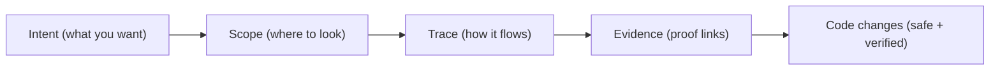
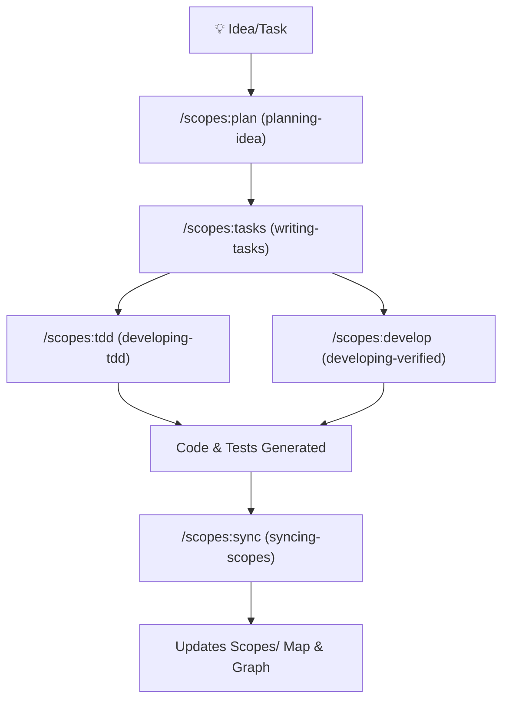

# Scopes: Evidence‑Backed AI Skills for Real Codebases

**Stop pasting folders. Stop guessing. Start shipping with proof.**

Scopes is a set of **skills** and **agents** that turns your repo into a map your AI assistant can reliably navigate. It adds an opinionated, evidence-backed layer ("Scopes") that translates **human intent** (features, capabilities, flows) into **code truth** (exact files + line ranges, tests, config, schemas).

If you've ever watched an assistant "sound confident" while looking in the wrong place, this is the fix.


## Who this is for

- Engineers using AI assistants on real repos (not toy projects)
- Teams that care about correctness, maintainability, and repeatable workflows
- Teams hitting context-window ceilings and facing slow, expensive LLM inferences
- Anyone tired of paying tokens to brute-force "context" by pasting huge folders blindly

---

## The problem Scopes solves

When a developer asks an AI assistant to *"update the login flow"* or *"fix the payment bug"*, the assistant usually struggles with:

- **Intent ambiguity**: the request names a capability, but the assistant sees thousands of files.
- **Where-to-look failure**: you end up manually pointing to directories, hoping it's enough.
- **Token waste**: you paste large chunks of code to compensate.
- **Doc drift**: the "docs" don't match what the code actually does today.
- **Hallucinations**: when evidence is missing, the model fills the gap.

---

## The solution: a translation layer (Intent → Evidence → Code)

Scopes adds a first-class **navigation + compression layer** inside your repo:

- `Scopes/INDEX.md` — the map (what exists)
- `Scopes/GRAPH.md` — the dependency graph (what touches what)
- `Scopes/Product/**` — capability docs written from *observable reality*, with evidence links like:
  - `[path/to/file.ts:L20-L45](path/to/file.ts#L20-L45)` *(example)*
- `Scopes/DEVELOPER_INFO.md` — "how to run/test/build" discovered in repo truth
- `Scopes/Onboarding/TECH_STACK.md` — evidence-backed stack inventory
- `Scopes/Work/Standards/WRITE_STYLE.md` — engineering defaults for maintainable changes

Instead of dumping code into context, the assistant loads **one anchor Scope**, follows **traces**, then jumps to the **exact evidence** it needs.

### What a Scoped Repo Looks Like

```text
your-project/
├── src/                  # Your actual code
├── package.json          # Standard project files
└── Scopes/               # The "Map & Truth" injected by Scopes
    ├── INDEX.md          # The Map (What exists)
    ├── GRAPH.md          # The Dependency graph (What touches what)
    ├── DEVELOPER_INFO.md # How to run/test discovered in repo truth
    └── Product/          
        ├── Authentication/
        │   └── Login_Flow.md  <-- "Anchor Scope" with exact code links
        └── Payments/
            └── Checkout.md
```

Want the deeper explanation? Start here: [docs/why-scopes.md](docs/why-scopes.md)
Want “set-and-forget” maintenance workflows? See: [docs/automations.md](docs/automations.md)
Need authoring constraints and output schemas? See: [docs/contracts.md](docs/contracts.md) and [docs/context-engineering.md](docs/context-engineering.md)
Need local plugin setup details? See: [docs/settings.md](docs/settings.md)



```mermaid
flowchart LR
  I["Intent (what you want)"] --> S["Scope (where to look)"]
  S --> T["Trace (how it flows)"]
  T --> E["Evidence (proof links)"]
  E --> C["Code changes (safe + verified)"]
```

---

## The flagship skill: `syncing-scopes` (the Truth Engine)


`syncing-scopes` is the core of the system. It's a "Project Archivist" workflow that reads your codebase (tests/config/schema/impl) and generates or repairs `Scopes/` so it stays trustworthy.

What it enforces:

- **Observable reality only**: no guessing; missing proof becomes `[Unknown]`.
- **Evidence-backed claims**: important statements must link to code/tests/config with line ranges.
- **Drift repair**: treat existing `Scopes/` as potentially stale; fix what code changes made wrong.
- **Graph, not just tree**: keep `INDEX.md` and `GRAPH.md` as the canonical navigation surfaces.
- **Token-efficiency by design**: prefer the smallest scope slice needed to answer or implement.

Helper scripts included under `scopes/skills/syncing-scopes/scripts/`:
- `scope_map.py` — compact scope matrix view (areas/scopes/graph) with JSON output
- `drift_detector.py` — stale evidence detection via git timestamps
- `scope_skeleton_generator.py` — generate fill-ready capability scope skeletons from LLM-provided names
- `slice_contract_builder.py` — build Slice Contracts from drift output, skeletons, or repo inference
- `scope_trace_stub_from_entrypoints.py` — generate a trace-table stub from “Where to Start in Code” evidence links
- `scope_rename_guard.py` — rewrite scope markdown links across `Scopes/**` from a rename map JSON

---

## What you get in this repo

This repository is the **source package** for Scopes skills/agents you install into a coding assistant environment.

### Skills (commands)

- `scopes` — umbrella router: pick the right sub-skill when you’re not sure which one to run
- Sub-skills live under `scopes/skills/` and are loaded by the `scopes` router:
- `syncing-scopes` — generate/update `Scopes/` from code + git reality (wave model, parallel scope-fillers)
- `querying-scopes` — answer "how/where/what depends on what" from `Scopes/` + evidence (parallel per-scope investigation)
- `planning-idea` — turn an idea into a scope-native implementation blueprint (parallel context lanes + per-scope research)
- `writing-tasks` — convert intent into engineer-ready tasks under `Scopes/Work/Tasks/**` (parallel task generation + hygiene)
- `developing-verified` — implement changes with sandbox verification (parallel IMPL + REFACTOR waves)
- `developing-tdd` — implement changes via strict TDD (parallel RED + GREEN + REFACTOR waves)
- `planning-refactor` — plan safe green-to-green refactors with scope link maintenance (parallel risk signals + phase research)
- `scanning-refactor` — scan Scopes + code for refactor/simplification opportunities (mandatory parallel per-scope scanning)
- `researching-decisions` — compare options and write evidence-backed ADRs (parallel per-option research)
- `brainstorming-project` — interactive design brainstorm with Scopes + patterns + web research (parallel evidence lanes)

### Shared infrastructure

- `scopes/skills/_shared/SCOPES_PROTOCOL.md` — Scopes-first startup, upstream artifact intake, agent delegation thresholds, automated gates, parallelism rules
- `scopes/skills/_shared/SLICE_CONTRACT.md` — standardized delegation format with universal JSON receipts
- `scopes/skills/_shared/DEVELOPING_PROTOCOL.md` — shared verification-first loops for developing-* skills
- `scopes/skills/_shared/GOF_PATTERNS.md` — design pattern vocabulary for consistent naming
- `scopes/skills/_shared/SESSION_LOG_TEMPLATES.md` — session log structure templates
- `scopes/skills/_shared/SCRIPT_DISCOVERY.md` — SKILLS_ROOT resolution snippet
- `scopes/skills/_evaluations/` — evaluation scenarios for testing skill effectiveness

### Agents (roles)

**Implementation agents:**
- `slice-developer` — the core coding agent: writes tests (RED), production code (GREEN), or fixes (FIX) for a single behavior slice with exclusive ownership, pattern conformance, and guard command verification (Slice Contract)
- `code-simplifier` — simplify recent changes without behavior changes (Slice Contract + guard command)

**Review + quality gate agents:**
- `code-reviewer` — review diffs and report only high-confidence issues (read-only, Slice Contract)
- `silent-failure-hunter` — hunt for swallowed errors, empty catch blocks, and misleading fallbacks; cross-references scope behavioral promises (read-only, Slice Contract)
- `test-coverage-auditor` — audit test quality post-GREEN: validates acceptance example coverage, behavioral coverage, and test resilience (read-only, Slice Contract)
- `pattern-conformance-checker` — verify that new code follows the repo's established patterns for its category (read-only, Slice Contract)
- `plan-gate-checker` — validate artifacts (plans, tasks, scans, ADRs) against deterministic gate rules from SCOPES_PROTOCOL.md (read-only, Slice Contract)

**Investigation + scanning agents:**
- `bug-scanner` — hotspot scan + scope context, 4 evidence lanes (Slice Contract, writes to `Scopes/Work/Bugs/`)
- `refactor-scanner` — scan for maintainability/refactor opportunities, per-scope parallel (Slice Contract, writes to `Scopes/Work/Refactors/`)
- `scope-investigator` — deep per-scope execution tracing for planning/research/querying skills; one per scope in parallel (read-only, Slice Contract)

**Scope maintenance agents:**
- `scope-filler` — fill new capability scope skeletons using evidence (one per scope in parallel, Slice Contract)
- `evidence-verifier` — validate that evidence links in Scope files are still accurate at the content level, beyond timestamp-based drift detection (read-only, Slice Contract)

**Support agents:**
- `context-summarizer` — stabilize a working-set summary after tool-heavy phases with scope anchoring and `## Links` for downstream chaining (Slice Contract, writes to `Scopes/Work/Notes/`)

---

## Getting started (recommended path)

### Option A: Claude Code Plugin (recommended for Claude Code users)

Scopes is packaged as a **Claude Code plugin**. Install it once and get all skills, agents, and slash commands.

**Local install (for development/testing):**
```bash
claude --plugin-dir /path/to/Scopes
```

**From a plugin marketplace** (if your team has one configured):
```bash
# Inside Claude Code
/plugin install scopes
```

Once installed, all commands are available under the `/scopes:` namespace:

| Command | What it does |
|---|---|
| `/scopes:sync` | Generate or update Scopes from code reality |
| `/scopes:query <question>` | Ask about the project using Scopes navigation |
| `/scopes:plan <idea>` | Turn an idea into an implementation blueprint |
| `/scopes:develop <task>` | Implement with sandbox verification |
| `/scopes:tdd <task>` | Implement via strict TDD (red/green/refactor) |
| `/scopes:refactor <target>` | Plan a safe, incremental refactor |
| `/scopes:tasks <intent>` | Convert intent into engineer-ready task files |

If your assistant environment doesn’t support `/scopes:` slash commands (or you’re unsure which command to pick), invoke the `scopes` router skill and describe your goal — it routes to the right sub-skill.

This package can be installed as a Claude Code plugin; keep the installed skills aligned with your preferred distribution/update process.

### Option B: Manual skill copy (Cursor, other assistants)

This repo is the source; your *project* is the target. Typical targets:

- Cursor: `.cursor/skills/`
- Claude: `.claude/skills/`
- Other setups: `.agent/skills/`

Copy or sync this repo's `scopes/` (and optionally `agents/`) into your target project.

Example (Cursor):
```bash
mkdir -p .cursor/skills
cp -R /path/to/Scopes/scopes .cursor/skills/
cp -R /path/to/Scopes/agents .cursor/
```

### After installation: Run `syncing-scopes`

Generate or repair `Scopes/` so the rest of the system has a trustworthy map to route through.

```bash
# Claude Code plugin:
/scopes:sync

# Manual install:
# Ask your assistant to use `scopes` (router) and say “sync scopes docs”
```

### Use Scopes-first workflows day to day

Here is how the day-to-day workflow looks when using these skills:


```mermaid
flowchart TD
    Idea["💡 Idea/Task"] --> Plan["/scopes:plan (planning-idea)"]
    Plan --> Tasks["/scopes:tasks (writing-tasks)"]
    Tasks --> TDD["/scopes:tdd (developing-tdd)"]
    Tasks --> Dev["/scopes:develop (developing-verified)"]
    
    TDD --> Code["Code & Tests Generated"]
    Dev --> Code
    
    Code --> Sync["/scopes:sync (syncing-scopes)"]
    Sync --> Update["Updates Scopes/ Map & Graph"]
```

Examples:

- "Where is the payment validation logic?" → `/scopes:query` or `querying-scopes`
- "Plan the new retry strategy" → `/scopes:plan` or `planning-idea` → `writing-tasks`
- "Implement the change safely" → `/scopes:develop` or `/scopes:tdd`
- "Did docs drift?" → `/scopes:sync` (then run validators)

---

## Why this reduces tokens (and increases correctness)

Scopes changes the retrieval unit from "files/folders" to "capabilities with evidence".

You provide:
- **One intent** ("Login", "Payments", "Retry policy")

Scopes provides:
- **One anchor document** (`Scopes/Product/...`)
- **One trace** (end-to-end flow table)
- **A handful of evidence links** (exact code/test/config lines)

That's less context, higher signal, and dramatically less room for guessing.

When you already have a task/plan/research artifact, open it and follow its `## Links` section (anchor scopes, pattern references, verification commands). Use `scope_map.py --query "<keywords>"` if you need a fast route to related scopes.

### Design Principles (All Skills)

Every skill in this package follows four cross-cutting principles:

1. **Upstream Artifact Intake**: before re-discovering context, check for prior artifacts (`## Links` sections). The chain `brainstorm → plan → tasks → develop` never re-navigates.
2. **Mandatory Parallel Delegation**: any phase with 2+ independent work units delegates to parallel agents with Slice Contracts — this applies to ALL skill types, not just development.
3. **Universal JSON Receipts**: every subagent returns a structured receipt enabling automated orchestration decisions. No receipt = task incomplete.
4. **Automated Gates**: Plan Gates, Task Gates, Scan Gates, and ADR Gates use deterministic checks instead of manual checklists.

---

## The promise

Scopes doesn't make models smarter.

It makes them **better grounded**: they know what you mean, where to look, what changed, and what is proven—so they can help with real Day‑2 engineering work: refactors, bugs, plans, tasks, and decisions.

**Build better. Document automatically. Scope everything.**

---

## Quality Gates (This Repo)

Run the repo linters locally:

```bash
make lint
```

What this enforces:
- Skills and agents follow `docs/contracts.md` (frontmatter, budgets, stop conditions, verdict vocabulary, output contracts).
- Package consistency: README lists match `scopes/skills/**` + `agents/*`; commands reference valid skills; canonical protocol references exist.

## Pre-Merge Validation (For Repos With `Scopes/`)

Before merging changes that touch `Scopes/**` or files referenced by scope evidence:

```bash
python3 scopes/skills/syncing-scopes/scripts/drift_detector.py --all --stale-only --limit 20
```

## Canonical Paths + Compatibility Aliases

- Canonical shared protocol: `scopes/skills/_shared/SCOPES_PROTOCOL.md`
 
