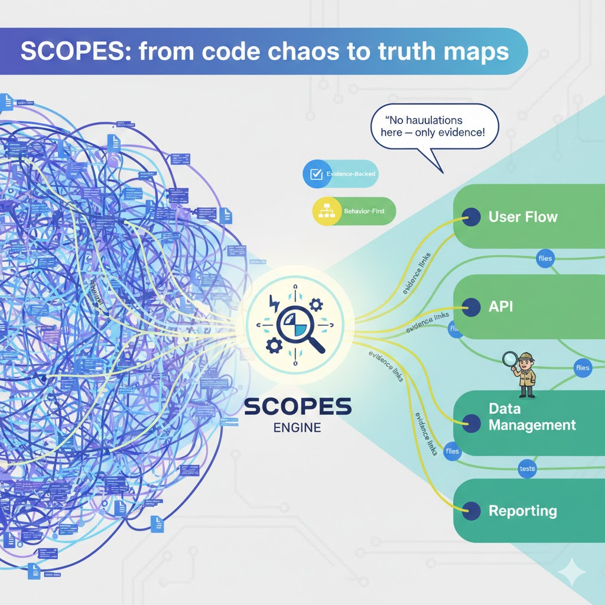

# Scopes — The Translation Layer for Agentic Coding

> **Give your AI a brain. Stop pasting context.**

**Scopes** bridges the gap between *what you want* and *where it lives*. It turns your codebase into a structured, evidence-backed knowledge graph that agents can read, understand, and navigate—without needing to hallucinate or scan every single file.

---



## The Problem: "Context Window Overflow"

When you ask an AI to "fix the auth login," it has two bad options:
1.  **Guess:** Hallucinate a file structure that looks standard but doesn't exist.
2.  **Crash:** Try to read your entire repo, hit the token limit, and forget what it was doing.

You spend half your time pasting file paths and correcting its assumptions.

## The Solution: Scopes

Scopes introduces a **Translation Layer** between your intent and your code.

Instead of raw files, your AI interacts with **Scopes**—compact, high-level maps of your system's capabilities (e.g., `Scopes/Product/Auth/Login.md`). Each Scope is linked to the **exact lines of code** that prove it works.

When you say "Fix Auth," the agent looks at the **Auth Scope**, sees exactly which 3 files matter, and loads *only* those. It translates "developer intent" into "code evidence."

## Why Scopes?

### 1. Readable & Maintainable Trust
Scopes aren't just docs; they are **evidence**. Every claim in a Scope is linked to a line of code or a test. If the code changes and the link breaks, the Scope is marked "Stale." You never have to wonder if the docs are lying.

### 2. Intent Understanding
Scopes translate "developer speak" into "agent actions."
*   **You say:** "Update the pricing model."
*   **Agent reads:** `Scopes/Product/Billing/Pricing.md`
*   **Agent knows:** "Pricing logic is in `src/billing/engine.ts` and the tests are in `tests/billing/`. I don't need to look at the UI."

### 3. Precision Locality
Agents stop searching blindly. They go straight to the Truth.
*   **Without Scopes:** `grep -r "price" .` (Thousands of results, mostly noise).
*   **With Scopes:** Open `Scopes/Product/Billing`, utilize the link to `calculatePrice()` implementation.

### 4. Token Economy
Scopes are optimized for LLMs. They are dense, structured summaries.
*   **Raw Code:** 100k tokens.
*   **Scope File:** 500 tokens.
*   **Result:** You can fit the *entire architecture* of your app in the context window, leaving room for the actual work.

### 5. Day-to-Day Agent Integration
Scopes ships with **Agents** and **Skills** that live in your terminal and work alongside you:
*   **`dev-tdd`**: "Implement this feature using strict TDD, and update the Scopes when you're done."
*   **`bug-hunt`**: "Find the bug in this Scope, and prove it with a test case."
*   **`sync-scopes`**: "I changed the code. Update the docs for me."

## The Magic: `sync-scopes`

You don't write Scopes by hand. You use **`sync-scopes`**.

This skill scans your codebase, maps your files, and **generates the documentation for you** based on the actual code evidence. It creates the "Truth" from the ground up.

*   **Code changed?** Run `sync-scopes`. It diffs the reality against the docs.
*   **New feature?** Run `sync-scopes`. It creates the new Scope entry.

## Workflow Catalog

Get started with these evidence-backed workflows:

### 🚀 Ship Features
*   **`plan-idea`**: Turn a vague idea into a concrete plan.
*   **`write-tasks`**: Break that plan into engineer-ready tasks.
*   **`dev-tdd`**: Implement the tasks with a strict Red-Green-Refactor loop.

### 🐛 Fix Bugs
*   **`bug-hunt`**: Locate bugs by traversing the Scope graph.
*   **`dev-verify`**: Fix the bug and verify it with evidence.

### 🧠 Maintain Truth
*   **`sync-scopes`**: The core engine. Updates your Scopes to match reality.
*   **`ask-scopes`**: Ask questions about your project and get answers based on *facts*, not guesses.

## Installation

Copy the folders into your project's agent configuration:

### Cursor
```bash
cp -r /path/to/Scopes/skills/ .cursor/skills/
cp -r /path/to/Scopes/agents/ .cursor/agents/
```

### Claude Code
```bash
cp -r /path/to/Scopes/skills/ .claude/skills/
cp -r /path/to/Scopes/agents/ .claude/agents/
```

### Antigravity
```bash
cp -r /path/to/Scopes/skills/ .agent/skills/
cp -r /path/to/Scopes/agents/ .agent/agents/
```

---

<p align="center">
  <b>Scopes</b><br>
  <i>Because "What does this code do?" shouldn't be a mystery.</i>
</p>
