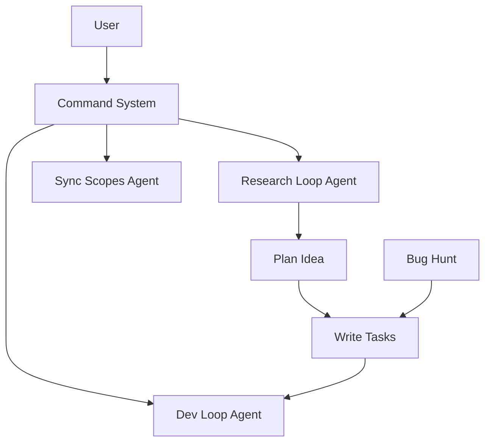

# Scope Network Graph

## Legend
- `-->` Depends On / Uses
- `..>` Possible Relation (Low confidence)

## Graph

## Evidence Table
| From | To | Relationship | Evidence Link |
|------|----|--------------|---------------|
| System | DevLoop | Contains File | [Scopes/Prompts/dev-loop.md:L1-L5](Scopes/Prompts/dev-loop.md#L1-L5) |
| System | SyncScopes | Contains File | [Scopes/Prompts/sync-scopes.md:L1-L5](Scopes/Prompts/sync-scopes.md#L1-L5) |
