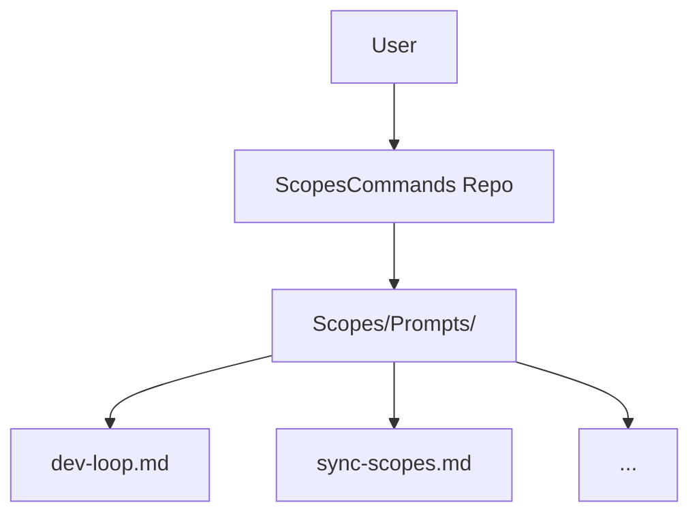

# Command System

## Summary
The Command System consists of a set of Markdown files in `Scopes/Prompts/`. When installed in Cursor, these files act as "Slash Commands" that instantiate specialized AI agents (e.g., `/dev-loop`, `/sync-scopes`).

## Users & Triggers
- **User**: Developers using Cursor.
- **Trigger**: Typing `/` followed by the command name (filename) in Chat.

## What Happens
1. User types `/command`.
2. Cursor loads the `.md` file as the System Prompt.
3. The Agent (LLM) adopts the `<ROLE>` and `<PRIME_DIRECTIVE>` defined in the file.
4. The Agent executes the `<WORKFLOW>` defined in the file.

## Rules & Constraints
- **Filename = Command**: The filename defines the trigger (e.g., `dev-loop.md` -> `/dev-loop`).
- **Markdown Format**: Prompts must use standard Markdown structured with XML-like tags for sections.

## Use Cases
- **Use case**: Run TDD Cycle
  - **Trigger**: User runs `/dev-loop`
  - **Outcome**: Agent drives strict Red-Green-Refactor.
  - **Evidence**: `[Scopes/Prompts/dev-loop.md:L1-L10](Scopes/Prompts/dev-loop.md#L1-L10)`

- **Use case**: Sync Documentation
  - **Trigger**: User runs `/sync-scopes`
  - **Outcome**: Agent maps the codebase to `Scopes/`.
  - **Evidence**: `[Scopes/Prompts/sync-scopes.md:L1-L10](Scopes/Prompts/sync-scopes.md#L1-L10)`

## Scope Navigation
- **Parent**: [Index](../INDEX.md)
- **Children**: None (Leaf)

## Scope Network (Cross-links)
- **Uses**:
  - [Prompts Directory](../Prompts) `[Scopes/Prompts:L1](Scopes/Prompts)`

## Diagrams (Mermaid inline)

### Diagram 1: Core Flow
```mermaid
flowchart TD
  User[User /slash-command] --> Cursor[Cursor IDE]
  Cursor --> Load[Load Markdown Prompt]
  Load --> Context[Inject Context <br> (Files/Cursor)]
  Context --> Agent[AI Agent Active]
  Agent --> Output[Artifacts/Code]
```

### Diagram 2: Ecosystem


## Usage & Flow Traces
| Step | Layer | Evidence Link | Description |
|------|-------|---------------|-------------|
| 1 | Definition | [Scopes/Prompts/dev-loop.md:L2](Scopes/Prompts/dev-loop.md#L2) | Command name definition `# COMMAND: dev-loop` |
| 2 | Role | [Scopes/Prompts/dev-loop.md:L5](Scopes/Prompts/dev-loop.md#L5) | Role assumption `You are the Scope TDD Driver` |

## Code Evidence (Consolidated)
| Evidence Link | What it proves |
|--------------|-----------------|
| [Scopes/Prompts/dev-loop.md:L2](Scopes/Prompts/dev-loop.md#L2) | Definition of dev-loop command |
| [Scopes/Prompts/sync-scopes.md:L1](Scopes/Prompts/sync-scopes.md#L1) | Definition of sync-scopes agent |

## Confidence & Notes
- **Confidence**: High
- **Notes**: This Scope describes the *mechanism* of the repo itself.
