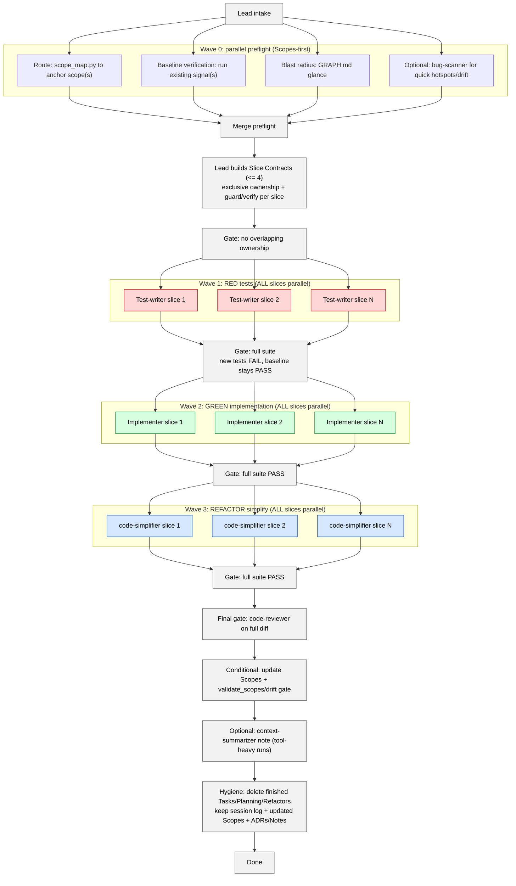

# Agent Workflow — Micro-Swarm Orchestration Pattern

> **Skills embed their own Agent Orchestration** with concrete prompts, parallel
> groupings, and output-handling instructions. This document is the architectural
> reference for the agent system. See individual `skills/*/SKILL.md` files for
> the executable orchestration steps that implement these patterns.

Based on three orchestration primitives:

1. **Skills** = reusable SOPs (the `SKILL.md` files — what to do)
2. **Subagents** = focused contractors with context isolation (the `agents/*.md` files — who does it)
3. **Agent Teams** = multiple Claude Code sessions coordinating via shared tasks + messaging (for heavy parallel work)

And four hard constraints:

1. **Coordination overhead is real** → minimize handoffs; use Slice Contracts to give each worker everything upfront
2. **Context must be decomposed hard** → each subagent/teammate gets a tiny, self-contained slice
3. **Agent teams are experimental** → enforce ownership (one slice = one agent), no cross-agent file edits
4. **Long-running work needs artifacts** → every cycle MUST leave a structured artifact, not just a summary

---

## Agent Roster

| Agent | Role | Phase | Writes Code? | Background? |
|---|---|---|---|---|
| `slice-developer` | Implement features (RED/GREEN/FIX) | Implementation (Wave 1+2) | Yes | No |
| `bug-scanner` | Scan hotspots & security | Investigation | No | No |
| `code-reviewer` | Review changes (high-confidence) | Review (Final Gate) | No | No |
| `code-simplifier` | Simplify recent changes | Refinement (Wave 3) | Yes | No |
| `context-summarizer` | Stabilize working set | Support | Docs only | No |
| `scope-filler` | Fill new scope skeletons | Scope maintenance | Scopes only | No |
| `refactor-scanner` | Scan for refactor opportunities | Investigation | No | No |
| `evidence-verifier` | Validate scope evidence links | Scope validation | No | No |
| `test-coverage-auditor` | Audit test quality post-GREEN | Quality gate | No | No |
| `silent-failure-hunter` | Hunt error handling issues | Review (Final Gate) | No | No |
| `scope-investigator` | Deep per-scope analysis | Planning/Research | No | No |
| `plan-gate-checker` | Validate artifacts against gates | Quality gate | No | No |
| `pattern-conformance-checker` | Verify pattern conformance | Quality gate | No | No |

---

## Core Principle: Context Isolation + Slice Contracts

Subagents and teammates are about **context isolation**: verbose work (reading 20 files, running test suites, scanning patterns) stays contained. The orchestrator only receives structured JSON receipts.

**Every delegation MUST use a Slice Contract** (see `skills/_shared/SLICE_CONTRACT.md`):
- **Target**: what to work on
- **Ownership**: files this agent may edit (exclusive — no overlaps)
- **Context bundle**: pre-gathered info so the agent doesn't re-discover
- **Acceptance**: checkable definition of done + guard command
- **Artifact required**: what the agent MUST leave behind

---

## When to Use Subagents vs Agent Teams vs Lead-Only

**Parallel execution is MANDATORY** when delegating to 2+ subagents or teammates. All skills follow `skills/_shared/SCOPES_PROTOCOL.md`: no sequential fallback when work is split into multiple units.

⚠️ **Spawn ALL subagents in a SINGLE tool-call batch** for parallelism. Spawning one per turn makes them sequential and violates the protocol.

| Situation | Approach | Why |
|---|---|---|
| 1 scope fill | **Subagent** (single) | Low overhead |
| 2+ scope fills | **Agent Team** (Preferred) | Guaranteed parallelism |
| Feature Implementation (TDD/Verified) | **Subagents** (`slice-developer`, parallel batches) | Lead orchestrates, agents do the work |
| Simple/Tiny edit (< 5 mins) | **Lead only** | Subagent overhead exceeds benefit |
| Multi-aspect review (security + perf + coverage) | **Agent Team** (3 reviewers) | Each reviewer is independent, can share findings |
| Final gate review | **Subagents** (`code-reviewer` + `silent-failure-hunter`, parallel) | Independent specialized reviews |
| Bug investigation with competing hypotheses | **Agent Team** (investigators) | Can debate and disprove each other |
| Needs user choice / product decision | **Lead only** | Decisions can't be delegated |
| code-simplifier after implementation | **Subagent** (single) | One focused task, clear ownership |
| code-reviewer as final gate | **Subagent** (single) | One focused task, clear verdict |
| Need stable summary after tool-heavy work | **Subagent** (`context-summarizer`) | Context compression |
| Per-scope investigation (2+ scopes) | **Subagents** (`scope-investigator`, parallel) | One per scope, evidence-lane receipts |
| Artifact validation after skill completes | **Subagent** (`plan-gate-checker`) | Deterministic gate enforcement |
| Test quality audit post-GREEN | **Subagent** (`test-coverage-auditor`) | Validates acceptance coverage |
| Pattern check on new files | **Subagent** (`pattern-conformance-checker`) | Prevents second-pattern drift |
| Scope evidence validation | **Subagent** (`evidence-verifier`) | Content-level link verification |

---

## Agent Teams — When and How

Agent teams coordinate multiple Claude Code sessions with shared tasks and messaging.

### Enable

Set in your `settings.json`:
```json
{ "env": { "CLAUDE_CODE_EXPERIMENTAL_AGENT_TEAMS": "1" } }
```

### Spawn Patterns

**Scope filling (4+ scopes):**
> Create an agent team with {N} teammates. Each teammate fills one scope file.
> Assign each teammate a scope from this list: {scope_list}.
> Each teammate reads their Slice Contract from `{contract_file}`.
> Use Sonnet for each teammate.

**Parallel code review:**
> Create an agent team with 3 reviewers:
> - One focused on security (token handling, input validation, secrets)
> - One on performance (N+1 queries, unnecessary allocations, blocking calls)
> - One on test coverage (missing edge cases, brittle assertions)
> Each reviewer reads the diff: `git diff {base}..HEAD`
> Report findings with confidence ≥ 80%.

**Bug investigation:**
> Spawn {N} teammates to investigate different hypotheses for: {bug_description}.
> Have them talk to each other to disprove each other's theories.
> Update `Scopes/Work/Bugs/{slug}.md` with consensus.

### Rules

1. **WIP limits**: max 6 teammates for scope filling, max 3 for reviews, max 4 for implementation slices
2. **Exclusive ownership**: each teammate owns specific files — no overlapping edits
3. **Slice Contracts**: every teammate gets a pre-built contract (from `slice_contract_builder.py` or manually)
4. **Wait for completion**: always tell the lead to wait for teammates before proceeding
5. **Clean up**: always clean up the team when done: `Clean up the team`
6. **No nested teams**: teammates cannot spawn their own teams

### Quality Gates (Hooks)

Use `TeammateIdle` and `TaskCompleted` hooks to enforce standards:
- `TeammateIdle`: check if the teammate actually wrote a JSON receipt → if not, send feedback
- `TaskCompleted`: run `drift_detector.py --scope {target}` → if stale, prevent completion

---

## Summarization Checkpoint (Mandatory Pattern)

After any tool-heavy phase or multi-agent burst, stabilize the working set:
- Goals
- Constraints
- Current plan
- Key findings (with evidence)
- Unknowns (use `[Unknown]`)
- Next action

If the summary would be long, invoke `context-summarizer` to write a durable note to `Scopes/Work/Notes/**` and return only a pointer.

---

## Workflows

### 1. New Feature Implementation (Micro-Swarm per Behavior)



**Step 2 details:**
- **Waves, not queues:** RED runs for all slices → gate → GREEN for all slices → gate → REFACTOR for all slices → gate.
- Gates are deterministic: the orchestrator runs the full suite (or full verification) and routes failures back to the responsible slice.
- `code-simplifier` gets a tight Slice Contract: exact file list + guard/verify command.
- After completion, enforce hygiene: delete executed task files and executed planning/refactor-plan artifacts; keep session log + updated Scopes.

---

### 2. Bug Investigation & Fix

```
┌─────────── STEP 1: INVESTIGATE (parallel) ────────────┐
│                                                        │
│  IF simple (one area):                                 │
│    Spawn bug-scanner (subagent)                        │
│                                                        │
│  IF complex (multiple hypotheses):                     │
│    Spawn Agent Team with 2-4 investigators             │
│    Each investigates a different hypothesis             │
│    They message each other to debate/disprove          │
│    Converge on consensus → write findings artifact     │
│                                                        │
└────────────────────────────────────────────────────────┘
                          │
                          ▼
┌─────────── STEP 2: FIX (lead, micro-swarm loop) ──────┐
│                                                        │
│  Same RED → GREEN → REFACTOR micro-swarm as features   │
│                                                        │
└────────────────────────────────────────────────────────┘
                          │
                          ▼
┌─────────── STEP 3: FINAL GATE + ARTIFACTS ────────────┐
│                                                        │
│  code-reviewer (subagent) + conditional scope sync     │
│  Write bug report to Scopes/Work/Bugs/                 │
│                                                        │
└────────────────────────────────────────────────────────┘
```

---

### 3. Scope Maintenance (Discovery Micro-Swarm)

```
┌─────────── STEP 1: DISCOVER (lead only) ──────────────┐
│                                                        │
│  IF Scopes/ is empty/missing:                          │
│    Infer areas from repo structure                      │
│    Build Slice Contracts: slice_contract_builder.py    │
│    Bootstrap META files first (DEVELOPER_INFO, etc.)   │
│  ELSE:                                                 │
│    drift_detector.py --all --format json               │
│    Build Slice Contracts from drift output              │
│                                                        │
└────────────────────────────────────────────────────────┘
                          │
                          ▼
┌─────────── STEP 2: FILL (Parallel, WIP ≤ 6) ──────────┐
│                                                        │
│  1 scope:    Subagent                                  │
│  2+ scopes:  Agent Team (Preferred)                    │
│  Fallback:   Parallel Subagents (ALL in one batch)     │
│                                                        │
│  Each filler gets a full Slice Contract:               │
│  - Scope path + likely entrypoints + tech stack        │
│  - Test command + related scopes                       │
│  - Must return JSON receipt                            │
│                                                        │
│  All workers run simultaneously → receipts feed S3     │
│                                                        │
└────────────────────────────────────────────────────────┘
                          │
                          ▼
┌─────────── STEP 3: STITCH (lead, incremental) ────────┐
│                                                        │
│  Read JSON receipts from all fillers                   │
│  Update INDEX.md with new scope references             │
│  Update GRAPH.md from graph_edges_found                │
│  Run drift_detector.py as final validation gate        │
│                                                        │
└────────────────────────────────────────────────────────┘
```

---

### 4. Planning / Research (Parallel Evidence-Backed)

```
┌─────────── STEP -1: UPSTREAM INTAKE ─────────────────┐
│                                                       │
│  Check for prior artifacts (brainstorm notes, scan    │
│  reports, ADRs). Read ## Links sections and skip      │
│  redundant scope navigation.                          │
│                                                       │
└───────────────────────────────────────────────────────┘
                          │
                          ▼
┌─────────── STEP 0: PARALLEL CONTEXT LANES ───────────┐
│                                                       │
│  Lane A: scope_map.py → anchor scopes (subagent)     │
│  Lane B: prior work scan (subagent)                   │
│  Lane C: pattern references (lead)                    │
│  Lane D: risk extraction / web research (subagent)    │
│                                                       │
│  ALL subagent lanes spawn in one batch                │
│  Each returns JSON receipt                            │
│                                                       │
└───────────────────────────────────────────────────────┘
                          │
                          ▼
┌─────────── STEP 0.5: PER-SCOPE RESEARCH (3+) ───────┐
│                                                       │
│  For 3+ TODO Scopes / options / hotspots:             │
│  Spawn one researcher per unit (parallel)             │
│  Each returns pattern refs + acceptance examples      │
│                                                       │
└───────────────────────────────────────────────────────┘
                          │
                          ▼
┌─────────── STEP 1: WRITE ARTIFACT ───────────────────┐
│                                                       │
│  Lead stitches receipts into blueprint/ADR/report     │
│  ## Links section IS the handoff for next skill       │
│  Machine-readable JSON block at end for downstream    │
│                                                       │
└───────────────────────────────────────────────────────┘
                          │
                          ▼
┌─────────── STEP 2: AUTOMATED GATE ───────────────────┐
│                                                       │
│  Plan Gate / ADR Gate / Scan Gate (Fix X4)            │
│  Validates: acceptance examples, pattern refs,        │
│  ownership collisions, evidence links, output caps    │
│                                                       │
└───────────────────────────────────────────────────────┘
```

---

### 5. Pre-Merge Validation (Parallel Review Team)

```
┌─────────── AGENT TEAM: 3 REVIEWERS ──────────────────┐
│                                                       │
│  Reviewer 1: Security focus                           │
│  Reviewer 2: Performance focus                        │
│  Reviewer 3: Test coverage focus                      │
│                                                       │
│  Each reads `git diff` independently                  │
│  Confidence ≥ 80 filter                               │
│  Merge verdicts → go/no-go                            │
│                                                       │
└───────────────────────────────────────────────────────┘
```

---

## Handoff Principles

1. **Slice Contracts for every delegation.** No naked prompts — always include target, ownership, context, acceptance, and artifact requirements.

2. **Micro-swarms, not assembly lines.** Each slice exits as green + simplified. No queues, no "refactor later" debt.

3. **Artifact-driven chaining.** The output of one skill feeds the next through `## Links` sections, JSON receipts, and session logs — not through re-navigation.

4. **Upstream intake before re-discovery.** Every skill checks for upstream artifacts (plans, scan reports, brainstorm notes, task files, ADRs) before running `scope_map.py` or reading `INDEX.md`. The chain `brainstorm → plan → tasks → develop` should never re-discover context. (See `skills/_shared/SCOPES_PROTOCOL.md` — Upstream Artifact Intake.)

5. **Deterministic triggers, not judgment calls.** `slice-developer` ALWAYS runs as RED/GREEN workers. `code-simplifier` ALWAYS runs in the REFACTOR phase. `code-reviewer` + `silent-failure-hunter` always run as the final gate (parallel). `test-coverage-auditor` runs post-GREEN. `pattern-conformance-checker` runs post-GREEN when new files are created. `plan-gate-checker` runs after every artifact-producing skill. `evidence-verifier` runs during scope sync when scope-linked files are in the diff.

6. **WIP limits prevent coordination breakdown.** Max 6 fillers, max 4 behavior slices, max 3 reviewers.

7. **Exclusive ownership prevents conflicts.** When using agent teams, no two teammates may edit the same file.

8. **JSON receipts enable orchestration.** Every subagent/teammate returns a universal JSON receipt (see `skills/_shared/SLICE_CONTRACT.md` — Fix X2). The lead uses receipts to make deterministic next-step decisions.

9. **Automated gates replace manual checklists.** Plan Gates, Task Gates, Scan Gates, and ADR Gates use deterministic checks (see `skills/_shared/SCOPES_PROTOCOL.md` — Fix X4) instead of subjective verification.

10. **All skills delegate at 2+ units.** Any phase with 2+ independent work units MUST delegate to parallel agents — this applies to planning/analysis skills too, not just development/sync. (See `skills/_shared/SCOPES_PROTOCOL.md` — Agent Delegation Threshold.)

---

## Orchestration Pattern (for the lead agent)

When implementing a feature, the lead follows this script:

```
1.  Wave 0 preflight (parallel if possible): route + baseline verify + blast radius + optional bug-scan
2.  Build Slice Contracts (<= 4) with exclusive ownership + verify/guard per slice
3.  Wave 1 RED: spawn all slice-developer agents (phase: RED) in one batch; gate with full suite
4.  Wave 2 GREEN: spawn all slice-developer agents (phase: GREEN) in one batch; gate with full suite
4b. Post-GREEN quality gates (parallel): test-coverage-auditor + pattern-conformance-checker (if new files)
5.  Wave 3 REFACTOR: spawn all code-simplifiers in one batch; gate with full suite
6.  Final gate (parallel): code-reviewer + silent-failure-hunter on full diff
6b. Artifact gate: plan-gate-checker on any artifacts produced in this session
7.  Conditional scope sync: update affected Scopes + evidence-verifier + validate gate
8.  Durable artifacts: session log + optional context-summarizer + any remaining active tasks
9.  Hygiene closure: delete finished Tasks/Planning/Refactors artifacts once work is complete
```

This is the engineering lifecycle: **slice → implement → audit → refactor → review → document → validate**.
