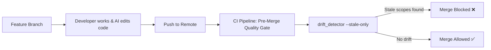

# Automations (Cost-Efficient Scopes Workflows)

These are optional “set-and-forget” workflows you can run on a schedule or in CI to keep Scopes truthful and navigation fast.

> Note: This repo is the *skills package*. The paths below assume you run the scripts from a project repo where `Scopes/` exists.

---

## 1) Drift Audit (Weekly)

Goal: catch scope drift early (before a big “sync everything” day).

Run:
```bash
python3 skills/syncing-scopes/scripts/drift_detector.py --all --stale-only --limit 50
```

Follow-up:
- If `stale > 0`, update the drifted scopes and re-run validation.

---

## 2) Artifact Router (Per Task/Plan)

Goal: route from a task/plan/research artifact to anchor scopes with minimal context.

Run:
```bash
python3 skills/syncing-scopes/scripts/scope_map.py \
  --from-artifact Scopes/Work/Tasks/<file>.md \
  --depth 3 --only tree
```

---

## 3) Pre-Merge Quality Gate (CI)

Goal: prevent merging changes that break evidence navigation.



Run:
```bash
python3 skills/syncing-scopes/scripts/drift_detector.py --all --stale-only --limit 20
```

If stale scopes are reported, update the affected scopes before merge.
