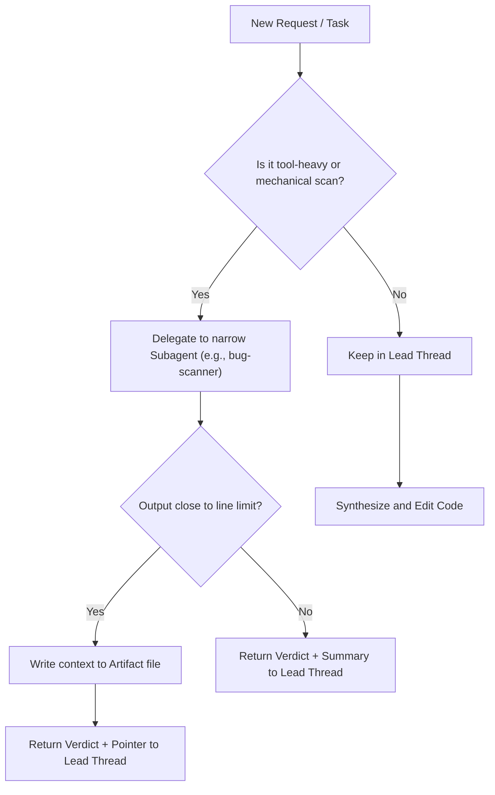

## Context Engineering (Skills + Subagents)

This repo is optimized for token-efficiency and correctness by making context control *structural*:
- Skills provide stable, repeatable workflows (static constraints).
- Subagents provide context isolation (dynamic constraints).

## Skills vs Subagents

- **Skills**: The main workflow contract. They define stop conditions, budgets, outputs, and handoffs.
- **Subagents**: Narrow, stateless roles used as a firebreak for tool-heavy exploration. They must return results, not history.

## "Return Results, Not History" Schema

Subagent returned summaries must fit their line limit and include:
- `Verdict:` `Proceed` | `Blocked` | `Needs Sync` | `Needs Narrowing`
- `Decision:` what was found/decided in 1-2 sentences
- `Evidence:` file refs / links (or `[Unknown]`)
- `Unknowns:` only if blocked/partial
- `Next:` one recommended next action
- `Artifact:` path or `(none)`

If the summary would be long, offload details to an artifact file and return only pointer + abstract + mini ToC.

## Delegation Heuristics

**Delegate to a subagent when:**
- You need to scan many files or run multiple commands.
- You need a narrow output (paths, counts, top-N) instead of full explanation.
- The work is mechanical (grep/rg patterns, link checking, drift checks).

**Keep work in the lead thread when:**
- The work is linear and requires tight iteration (edit -> verify -> edit).
- The output must be high-context synthesis that depends on user feedback.

## Parallelization Guidelines

Parallelize subagents when they do not depend on each other:
- `bug-scanner` + `code-reviewer` (independent scan + review)

Sequence subagents when outputs depend on each other:
- `bug-scanner` -> main agent diagnosis (when scan results drive next steps)

## Summarization Checkpoint Pattern

After any tool-heavy phase (or any multi-subagent burst), the lead thread should stabilize:
- Goals
- Constraints
- Current plan
- Key findings (with evidence)
- Unknowns (with `[Unknown]`)
- Next action

### Standard Artifact Roots (by type)

If an agent is about to exceed its output limit, it must write an artifact here and return only a pointer.

| Artifact Type | Path | Purpose |
|---|---|---|
| Bugs | `Scopes/Work/Bugs/**` | Hotspot analysis, bug scans, crash reports. |
| Notes | `Scopes/Work/Notes/**` | Temporary session notes, context summarization. |
| Plans | `Scopes/Work/Planning/**` | System architecture, feature refactoring plans. |
| Tasks | `Scopes/Work/Tasks/**` | Engineer-ready actionable steps to implement. |
| Research | `Scopes/Research/**` | Tech choices, comparisons (ADRs). |
