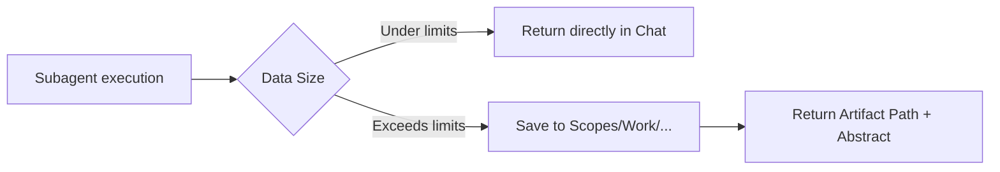

# Contracts (Skills + Agents)

This repo is a **skills/agents package**. These contracts define the *required* structure and output standards for:
- `skills/*/SKILL.md`
- `agents/*.md`

The goal is deterministic, evidence-first, token-bounded behavior that is regression-proof via linting + CI.

## Repo-Wide Defaults (Unless User Explicitly Requests Otherwise)

| Constraint | Limit / Rule |
|---|---|
| **Anchor scopes** | 1-3 |
| **Evidence links** | 3-7 |
| **Code files touched** | 3-10 |
| **Missing info** | Stop and label as `[Unknown]` |
| **Verdict vocabulary** | `Proceed`, `Blocked`, `Needs Sync`, `Needs Narrowing` |
| **Evidence format** | `[path:Lx-Ly](path#Lx-Ly)` |
| **Firebreak** | Subagents return results, not history (no tool dumps) |
| **Upstream intake** | ALL skills check for upstream artifacts before re-discovering context |
| **Parallel threshold** | 2+ independent work units MUST use parallel agents (all skill types) |
| **JSON receipts** | Every delegation returns a universal JSON receipt (no receipt = incomplete) |
| **Automated gates** | Plan/Task/Scan/ADR gates use deterministic checks, not manual review |

## Artifact Offloading Policy (Mandatory)

If a result would exceed the output contract line limit:
1. Write an artifact file to disk under the correct root.
2. Return only:
   - `Artifact:` path
   - 5-10 line abstract
   - mini ToC (3-8 bullets)

### Standard Artifact Roots (by type)

- Bug reports: `Scopes/Work/Bugs/**`
- Notes/summaries: `Scopes/Work/Notes/**`
- Plans: `Scopes/Work/Planning/**`
- Task files: `Scopes/Work/Tasks/**`
- Research reports: `Scopes/Research/**`

## Model Routing Policy (Default)

- Extraction/summarization agents: cheapest acceptable model.
- Synthesis/architecture agents: stronger model.
- Default: do not escalate unless ambiguity or high-stakes reasoning requires it.

---

## Skill Contract (`skills/*/SKILL.md`)

### Required YAML Frontmatter (Top of File)

Each skill file MUST start with YAML frontmatter that includes:
- `name`: must match the folder name (e.g. `skills/querying-scopes/` -> `name: querying-scopes`)
- `description`: 1-2 sentence summary of when to use it

### Required Sections (Headings)

Skills MUST include the following headings (verbatim or near-verbatim):

1. `## When to use this skill`
2. `## Prerequisites`
3. `## Safety and confirmations` (or `## Safety and constraints`)
4. `## Mission Start`
   - MUST reference the canonical shared protocol path: ``skills/_shared/SCOPES_PROTOCOL.md``
5. `## Kickoff` (a single next question)
6. `## Scope Connections` (inputs/outputs + typical handoffs)
7. `## When to Stop` (Mandatory)
   - MUST include the repo budget caps and the `[Unknown]` rule.
8. `## Blocked Runbook` (Mandatory)
   - Must include deterministic next actions (no silent stalls).
9. `## Output Contract` (Mandatory)
   - MUST include `Verdict:` with the allowed vocabulary.
   - MUST include an explicit max-line constraint (e.g. "Return <= 20 lines").

### Skill Output Rules

- Avoid tool dumps; if output would be long, offload to an artifact and return a pointer.
- When evidence is missing: write `[Unknown]` and stop.
- Evidence links must not be invented.
- ALL skills must include upstream artifact intake (check for prior `## Links` before re-navigating).
- ALL skills with 2+ work units must delegate to parallel agents with Slice Contracts.
- ALL artifacts must include a `## Links` section in standardized handoff format for downstream consumption.
- Machine-readable JSON outputs (receipts, task indexes, TODO Scope lists) are mandatory for chaining.

---

## Agent Contract (`agents/*.md`)

### Required YAML Frontmatter (Top of File)

Each agent file MUST start with YAML frontmatter that includes:
- `name`
- `description`
- `tools` (least privilege)
- `model`
- `readonly` (boolean)

If `readonly: false`, the agent MUST also declare:
- `allowed_output_roots`: list of permitted write roots (e.g. `Scopes/Work/Notes/`)

### Required Output Contract (Schema)

Each agent MUST include an `## Output Contract` section with:
- Explicit max line limit for the returned summary (e.g. "Return <= 15 lines").
- A "return results, not history" schema that includes these fields:
  - `Verdict:` `Proceed` | `Blocked` | `Needs Sync` | `Needs Narrowing`
  - `Decision:` 1-2 sentence summary of what was decided/found
  - `Evidence:` file refs / links (or `[Unknown]` when not found)
  - `Unknowns:` only if blocked/partial
  - `Next:` one recommended next action
  - `Artifact:` path or `(none)` (mandatory)

### Agent Stop Conditions (Required)

Agents MUST include a `## When to Stop` section describing:
- Scan budget (caps above)
- Hard stop conditions (diminishing returns, or after N high-confidence issues)
- `[Unknown]` and `Verdict: Needs Narrowing` guidance when inputs are ambiguous

### Least-Privilege Tooling

- Read-only agents MUST set `readonly: true` and omit write/edit tools.
- Write-capable agents MUST scope writes to explicit `allowed_output_roots`.
