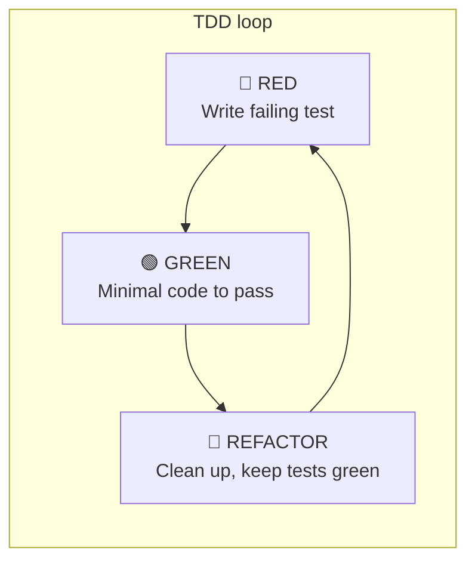
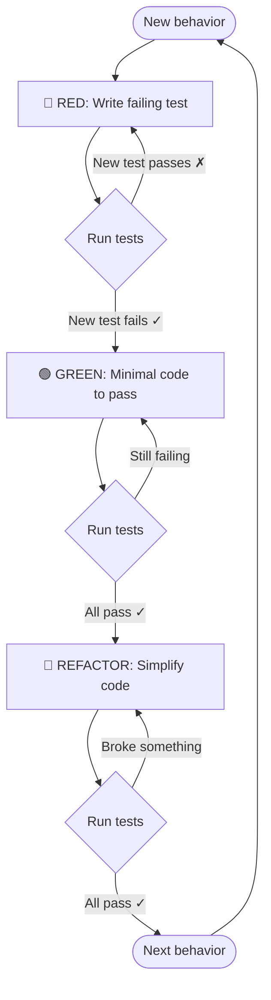

# How TDD Works

## Classic TDD cycle (RED → GREEN → REFACTOR)

**In words:**

1. **RED** — Write a test for the behavior you want. Run the suite; the new test must **fail** (no implementation yet).
2. **GREEN** — Write the **smallest** amount of code that makes that test pass. Run the suite; the new test (and all others) must **pass**.
3. **REFACTOR** — Improve the code (naming, structure, duplication). Run the suite after each change; everything must still **pass**. No new behavior.

Then repeat for the next behavior.

---

## Detailed flow (with gates)

---

## This project’s TDD (parallel waves)

The **developing-tdd** skill runs the same RED → GREEN → REFACTOR idea, but with **parallel agents** and **test-suite gates** between phases. See the wave diagram in `skills/developing-tdd/SKILL.md` (Architecture / Wave Model).

Summary:

- **Preflight** — Baseline tests, scope routing, blast radius.
- **Slice** — Break the goal into independent slices (each with one test file + impl files).
- **Wave 1 (RED)** — Parallel agents write failing tests per slice → gate: new tests fail, baseline passes.
- **Wave 2 (GREEN)** — Parallel agents implement per slice → gate: full suite passes.
- **Wave 3 (REFACTOR)** — Parallel code-simplifier per slice → gate: full suite still passes.
- **Final gate** — Full suite + code review; then scope sync, session log, hygiene.

The test suite is the single source of truth between each phase.
