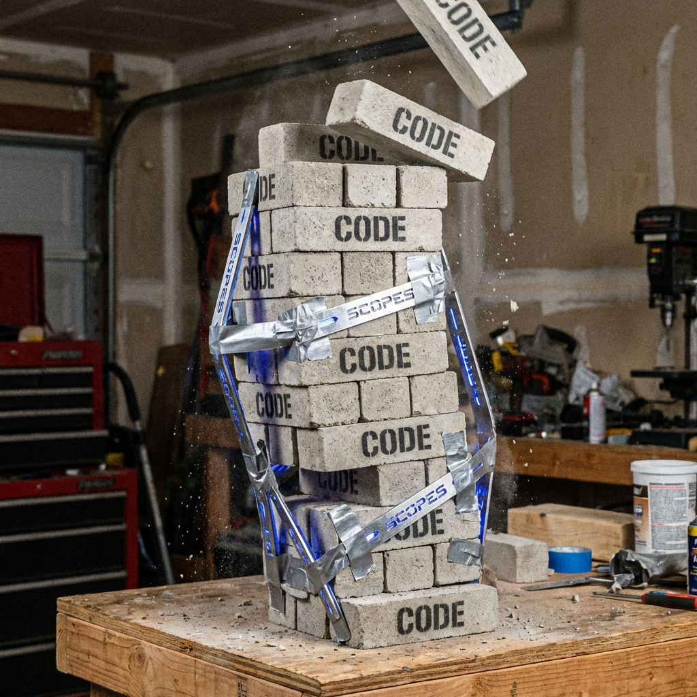
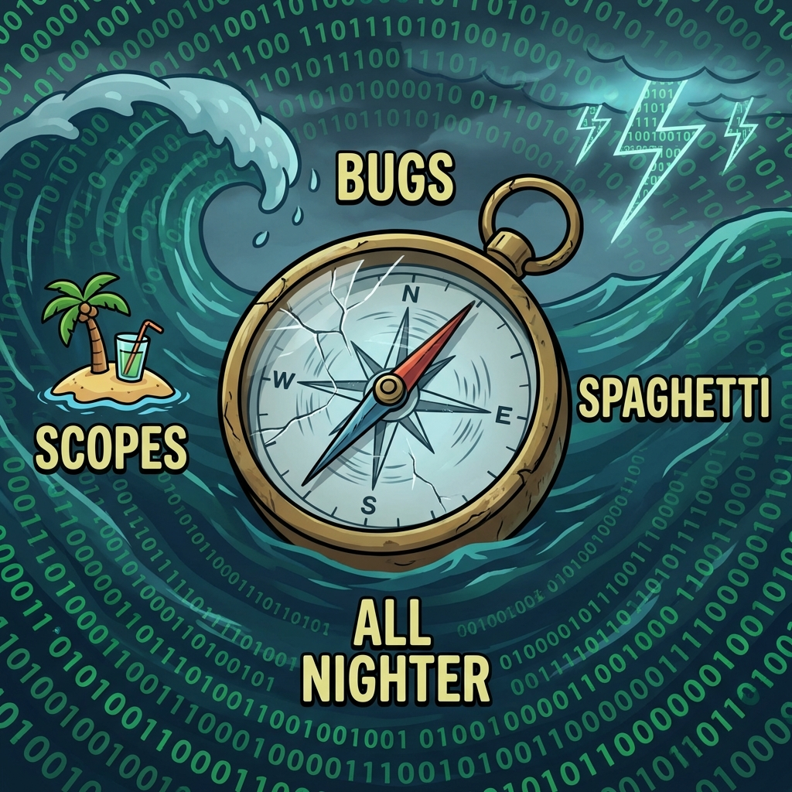

# Why Scopes (and why these skills exist)

Scopes are a deliberate answer to a common failure mode: **code changes fast, docs drift faster**.

## The idea in one paragraph

  
   
  <em>Without structure, adding one more feature is... risky.</em>

Raw codebases are high-entropy: lots of files, lots of local detail, and not enough product meaning. Scopes act as a **compression + navigation layer**: a map (`Scopes/INDEX.md`) and a graph (`Scopes/GRAPH.md`) plus evidence-backed capability docs (`Scopes/Product/**`) that describe what the system does today.

## What makes Scopes different

  
   
  <em>The only safe direction is known truth.</em>

- **Behavior-first**: describe what the software does today, not what we hope it does.
- **Evidence-required**: meaningful claims link to proof (code/tests/config/schema).
- **Maintained as part of dev**: the Scopes skills treat “update the truth” as part of normal work.

## How a code assistant should navigate (Scopes-first algorithm)
When working in a repo that uses Scopes, a copilot should **not** start by grepping code. It should route through Scopes:

1. **Map**: open `Scopes/INDEX.md` and identify the relevant capability area.
2. **Graph**: open `Scopes/GRAPH.md` to see dependencies, upstream/downstream scopes, and likely integration points.
3. **Anchor Scope**: open the primary capability file under `Scopes/Product/**`.
4. **Trace → Evidence → Code**:
   - Read **Where to Start in Code** (fast entrypoints).
   - Follow **Usage & Flow Traces** end-to-end.
   - Use **Code Evidence** links to jump into the exact code/tests/config proving each behavior.
5. **If the scope is missing or drifty**:
  - Run the `sync-scopes` skill to generate/update evidence-backed docs, or
   - Create a small task to repair the scope (add traces/evidence/required diagrams).
6. **After changes**:
   - Update the affected `Scopes/Product/**` docs (traces + evidence + diagrams),
   - Update `Scopes/GRAPH.md` if relationships changed,
   - Update `Scopes/DEVELOPER_INFO.md` if dev/test commands changed.

## References
If you want to go deeper, these are good starting points:

- [Beyond Code Generation: LLMs for Code Understanding](https://dev.to/eabait/beyond-code-generation-llms-for-code-understanding-3ldn)
- [CodeWiki: Evaluating AI's Ability to Generate Holistic Documentation for Large-Scale Codebases](https://arxiv.org/html/2510.24428v3)
- [SARA: Selective and Adaptive Retrieval-augmented Generation with Context Compression](https://arxiv.org/abs/2507.05633)
