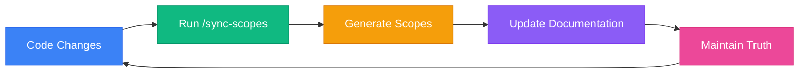
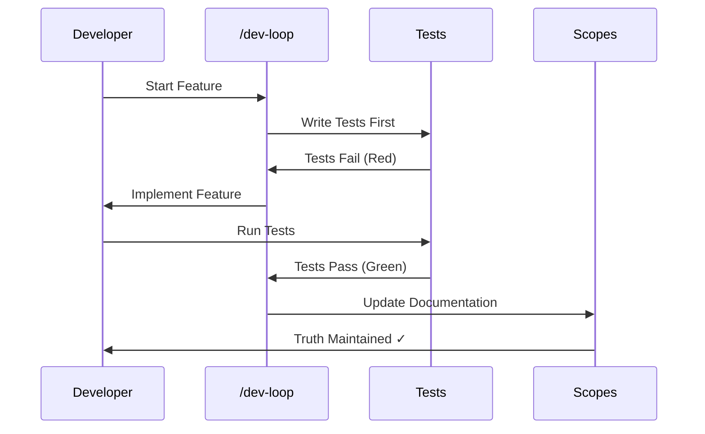
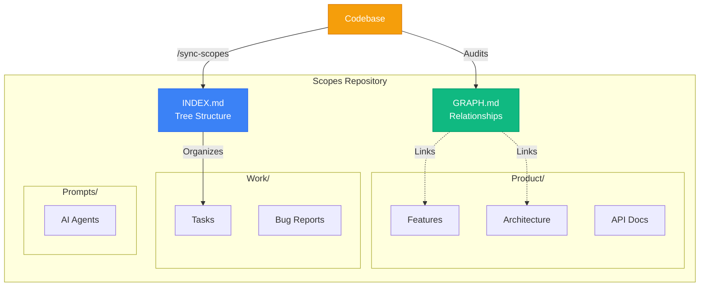
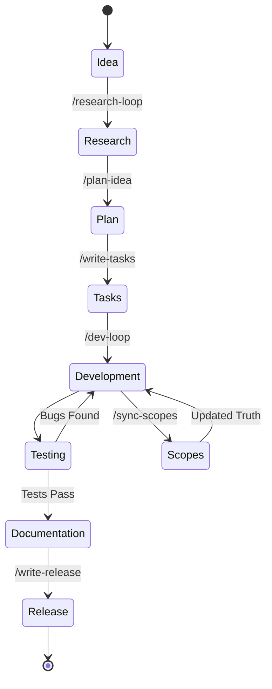
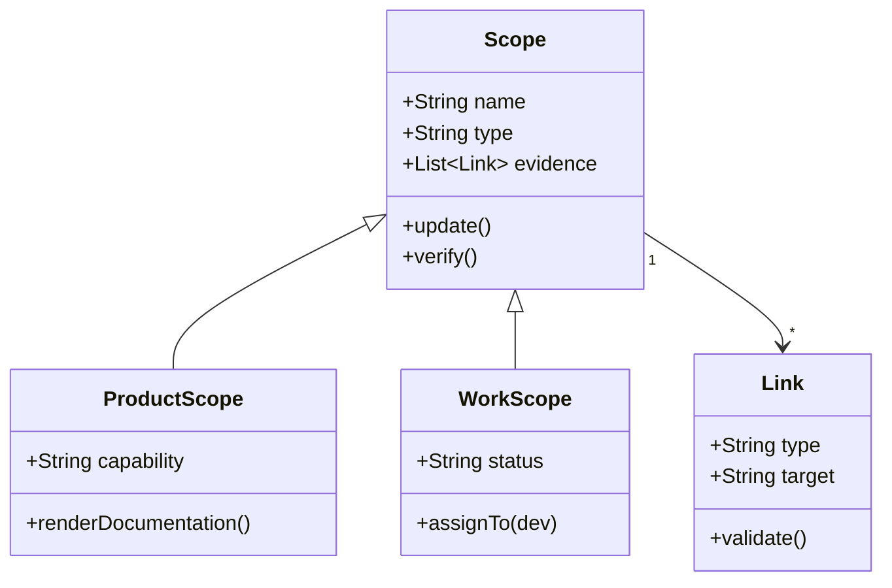
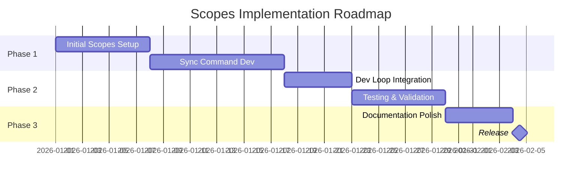

# Scopes Browser Demo

This demo showcases the **Scopes Browser** with diagram support.

## Features

- 📁 **File System Access API** - No server required
- 🎨 **Premium Dark UI** - Glassmorphic design
- 📊 **Mermaid Diagrams** - Render diagrams directly
- 🔍 **Syntax Highlighting** - Code blocks beautifully rendered

## Example: Scopes Workflow

Here's how the Scopes methodology works:

## Development Loop

The `/dev-loop` command follows this flow:

## Scopes Architecture

## State Machine Example

## Class Diagram Example

## Gantt Chart Example

---

**Try It Out**: Open this file in the Scopes Browser to see all diagrams rendered beautifully!
