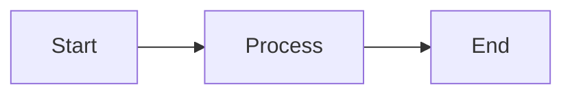

# Scopes Browser

A beautiful, serverless markdown and diagram viewer for your Scopes documentation.

## 🚀 Quick Start

1. **Open `index.html`** (double-click or drag into Chrome/Edge)
2. **Click "Select Scopes Folder"**
3. **Navigate to and select the folder containing this HTML file**
   - If this file is in `YourProject/installer/`, select the `installer` folder
   - If you've moved it to your Scopes root, select that root folder
4. **Browse your documentation** with beautiful rendering!

## ✨ Features

- ✅ **Zero dependencies** - No server, no build tools, just one HTML file
- 📊 **Mermaid diagrams** - Flowcharts, sequence diagrams, state machines, and more
- 🎨 **Premium dark UI** - Glassmorphic design with smooth animations
- 🔍 **Syntax highlighting** - Beautiful code blocks
- 🔒 **100% local** - Your files never leave your machine
- 📱 **Responsive** - Works on any screen size

## 📊 Diagram Support

The browser automatically renders Mermaid diagrams from code blocks:

````markdown

````

Supported diagram types:
- Flowcharts & Decision trees
- Sequence diagrams
- Class diagrams
- State machines
- Gantt charts
- ER diagrams
- Git graphs
- Pie charts

See `DEMO.md` for examples!

## 🛠️ Placement Options

### Option 1: In a Subdirectory (Recommended)
Keep it organized in `installer/`:
```
YourProject/
├── Scopes/
├── installer/
│   ├── index.html  ← This file
│   └── DEMO.md
└── README.md
```
When prompted, select the `installer` folder.

### Option 2: In Scopes Root
Copy to your main Scopes directory:
```
YourScopes/
├── index.html  ← This file
├── INDEX.md
├── GRAPH.md
├── Product/
└── Work/
```
When prompted, select the `YourScopes` folder.

## 🌐 Browser Support

**Fully Supported:**
- ✅ Chrome/Chromium (recommended)
- ✅ Microsoft Edge
- ✅ Arc Browser
- ✅ Brave

**Not Supported:**
- ❌ Firefox (File System Access API not yet implemented)
- ❌ Safari (Limited support)

## 🔒 Security & Privacy

- **Read-only access** - Cannot modify your files
- **One-time permission** - Grant once per browser session
- **No network requests** - Everything runs offline (except CDN for fonts/libraries)
- **No tracking** - Zero analytics, zero data collection

## 💡 Tips

- **Auto-open README**: The browser will automatically load README.md, INDEX.md, or GRAPH.md if found
- **Refresh**: Click the refresh button in the sidebar to rescan the directory
- **Internal links**: Markdown links between files work automatically
- **Drag & drop**: You can't drag files into the browser, but the file tree is fully interactive

## 🆘 Troubleshooting

**"Browser Not Supported" error**
- Use Chrome, Edge, or another Chromium-based browser

**Files not showing up**
- Click the refresh button (↻) in the sidebar
- Make sure you selected the correct folder
- Hidden files (starting with `.`) are automatically skipped

**Diagrams not rendering**
- Ensure you're online (Mermaid.js loads from CDN)
- Check browser console for errors
- Verify the diagram syntax is correct

**Permission denied**
- The browser will ask for permission each time you open the page
- This is a security feature - no way around it
- Once granted, the permission lasts for that browser session

## 📝 Example Usage

```bash
# If using this in a Scopes project
cd YourProject
open installer/index.html  # macOS
start installer/index.html  # Windows
xdg-open installer/index.html  # Linux
```

Then select the `installer` folder (or your Scopes root) when prompted.

---

**Made for the Scopes methodology** - Evidence-backed documentation that actually stays true. 🎯
