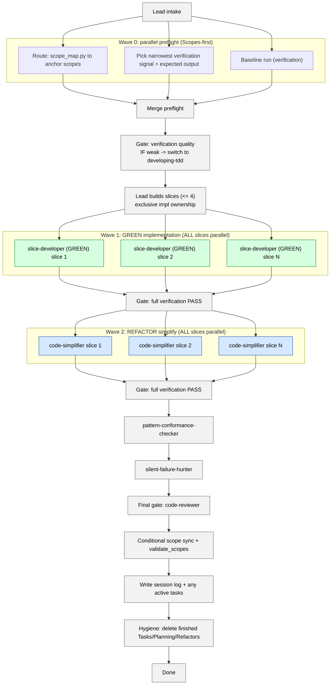

# Developing (Verified) — Parallel Phase-Gated Implementation

You implement features using **existing verification signals** (test suites, scripts, REPL, curl, build). You do NOT write new test files — use `developing-tdd` for that. Multiple agents implement slices in parallel; the orchestrator gates each phase by running verification.

## When to use this skill
Use when existing tests, scripts, or commands can verify your changes. If you need to write new tests, use `developing-tdd` instead.

## Example prompts
- "Make this change and verify with the existing test suite."
- "Fix this behavior without adding new tests; pick the best verification command."
- "Implement these slices in parallel and gate with verification."

## Prerequisites
- The repo has at least one runnable verification signal (tests, build, scripts, REPL).
- **Parallel subagents are MANDATORY**: the environment MUST support spawning multiple subagents in a single batch. Sequential fallback is not permitted. See `../_shared/SCOPES_PROTOCOL.md`.
- Read `../_shared/SCOPES_PROTOCOL.md` and `../_shared/DEVELOPING_PROTOCOL.md`.

## Mission Start
Load and follow the shared protocols:
- `../_shared/SCOPES_PROTOCOL.md` (Scopes-first startup)
- `../_shared/DEVELOPING_PROTOCOL.md` (verification-first loops)
- `../_shared/SLICE_CONTRACT.md` (delegation format)
- `../_shared/SESSION_LOG_TEMPLATES.md` (session log structure for Verified)
Design patterns (practical subset in implementation; recognize full GoF catalog to avoid misapplication):
- `../_shared/GOF_PATTERNS.md`

Resolve `SKILLS_ROOT` using the shared snippet:
- `../_shared/SCRIPT_DISCOVERY.md`

---

## Architecture (Wave Model)



---

## Workflow

### Step -1: Upstream Artifact Intake (mandatory check)

When invoked from a task file, read the task's anchor scope, pattern reference, verification command, and acceptance examples directly. Use the task's `## Ownership` section as the slice's `impl_files`. **SKIP scope_map routing** (Lane A below). If invoked freestanding (no upstream task), proceed to Step 0 normally.

(See `../_shared/SCOPES_PROTOCOL.md` → Upstream Artifact Intake.)

---

### Step 0: Smart Preflight (orchestrator, < 3 min)

These checks are independent. **Run them in parallel** (spawn all in one batch); merge the outputs. Parallel execution is mandatory for this skill (see SCOPES_PROTOCOL).

**Lane A: Route**
```bash
python3 "$SKILLS_ROOT/syncing-scopes/scripts/scope_map.py" \
  --query "<user goal keywords>" --limit 5 --format json
```
Result: anchor scope(s) + related code files + test commands.

**Lane B: Detect Best Verification Signal**

| Priority | Signal Type | How to Detect |
|---|---|---|
| 1 (best) | Specific test file for this area | `find . -path "*test*" -iname "*<area>*"` |
| 2 | Test suite (full) | `DEVELOPER_INFO.md` → test command |
| 3 | Script / REPL / curl | `DEVELOPER_INFO.md` → run/build commands |
| 4 (weakest) | Build compiles | `npm run build` / `go build ./...` / similar |

Record: `{ signal_type, exact_command, expected_output }`.

**Lane C: Baseline** — Run the verification signal:
```bash
<verification_command>
```
Record: `baseline = PASS | FAIL (N failures)`.

**Merge:** verification command ready + anchor scope identified + baseline captured.

**Gate: verification quality (deterministic)**
- If the best available signal is only “build compiles” or an ambiguous manual step, treat it as **weak** and switch to `developing-tdd` to create a behavior-linked test signal.
- If baseline fails before your changes, record baseline failures and either narrow the command or switch to TDD to stabilize signal.

**TDD Handoff Protocol:** IF switching to `developing-tdd`, write a handoff note containing: anchor scope, baseline result, files identified, and verification signal tried. Pass as initial context via `## Links` format. The TDD skill reads this and skips preflight re-run for already-gathered data.

---

### Step 1: Slice (orchestrator only, < 5 min)

Break the user's goal into **independent behavior slices**:

```json
{
  "slice_id": "slice-1",
  "behavior": "<one verifiable behavior>",
  "impl_files": ["<files the agent may edit>"],
  "verification_command": "<exact command from Step 0>",
  "expected_output": "<what success looks like>",
  "anchor_scope": "<path from Step 0>",
  "pattern_reference": "<path to existing similar implementation>"
}
```

**Rules:**
- Each slice = one verifiable behavior change
- Slices MUST be **independent** — no shared file edits across slices
- Each slice has **exclusive file ownership**
- If two slices need to edit the same file → merge them into one slice
- Max **4 slices** per batch (queue the rest)

**Single-slice fast-path:** IF only 1 slice → the lead implements directly (no subagent spawn). Skip REFACTOR agent spawn if change is < 20 lines. Still run `code-reviewer` as the final gate.

---

### Step 2: IMPLEMENT Phase (parallel agents)

⚠️ **Spawn ALL `slice-developer` agents in a SINGLE tool-call batch.**

For each slice, spawn a `slice-developer` subagent (see `agents/slice-developer.md`):

> **SLICE CONTRACT — GREEN PHASE**
> - **phase**: `GREEN`
> - **Target**: Implement: {behavior}
> - **Ownership**: You may ONLY edit: {impl_files}
> - **Verification**: Run `{verification_command}` after every edit — must match `{expected_output}`
> - **Pattern reference**: Follow patterns in {pattern_reference}
> - **⛔ Make small edits (< 20 lines each), verify after each one.**
> - **Artifact**: Return JSON receipt per `slice-developer` output contract

Wait for ALL agents to complete.

**GATE: Orchestrator runs full verification**
```bash
<full_verification_command>
```

**Verify:**
- All verification signals PASS
- Baseline signals still pass (no regressions)
- If some slices fail:
  → Spawn fix agents for ONLY the failing slices (same contract, add error output)
  → Re-gate after fixes
  → Max 3 fix cycles per slice before escalating

✅ Gate passes → proceed to REFACTOR
❌ After 3 fix cycles → set `Verdict: Blocked`, report which slices failed

---

### Step 3: REFACTOR Phase (parallel agents)

⚠️ **Spawn ALL simplifier agents in a SINGLE tool-call batch.**

For each slice, spawn `code-simplifier`:

> **SLICE CONTRACT — REFACTOR PHASE**
> - **Target**: Simplify the code changed in slice: {slice_id}
> - **Ownership**: {impl_files}
> - **Guard command**: `{verification_command}` — run after every simplification
> - **Acceptance**: Verification still passes. Code is cleaner. No behavior change.
> - **Artifact**: Return JSON: `{ "slice_id": "...", "files_simplified": N, "lines_removed": N, "files_read": [...], "key_findings": [...] }`

Wait for ALL agents to complete.

**GATE: Orchestrator runs full verification**
```bash
<full_verification_command>
```

✅ Gate passes → proceed to Final Gate

---

### Step 4: Final Gate (orchestrator only)

1. **Full verification** one last time.

2. Spawn **3 quality-gate agents in a SINGLE tool-call batch** (parallel):

   **Agent 1: `pattern-conformance-checker`** (see `agents/pattern-conformance-checker.md`):
   > Verify new code follows established repo patterns. Report deviations.

   **Agent 2: `silent-failure-hunter`** (see `agents/silent-failure-hunter.md`):
   > Scan changed files for inadequate error handling (empty catches, swallowed errors, misleading fallbacks).

   **Agent 3: `code-reviewer`** (see `agents/code-reviewer.md`):
   > Review all changes. Confidence >= 80 only. Report Scopes impact. Include drift detection.

3. **Merge gate receipts.** IF any agent reports high-severity issues:
   - Spawn `slice-developer` (phase: `FIX`) for the affected files
   - Re-run the failing gate agent(s) only
   - Max 2 fix cycles before escalating to user

---

### Step 5: Conditional Scope Sync

```bash
git diff --name-only | xargs -I{} rg -l "{}" Scopes/Product/ 2>/dev/null
```
IF output is non-empty → update affected scopes + run `validate_scopes.py` as the gate:

```bash
python3 "$SKILLS_ROOT/syncing-scopes/scripts/validate_scopes.py" --all
```
ELSE → skip.

---

### Step 6: Leave Durable Artifacts (mandatory)

1. **Session log** at `Scopes/Work/DEV/<session-slug>.md`

Per slice entry:
```markdown
### Slice: <behavior name>
- **Phase results**: IMPL ✅ → REFACTOR ✅
- **Verification**: `<command>` → `<result>`
- **Files changed**: <list>
- **Fix cycles**: <0-3>
- **Decision**: <what and why>
- **Follow-ups**: <parking lot>
```

2. Parking lot → task files (only for remaining work; tasks are not an archive). Use structured format:
   ```json
   [{ "item": "...", "source_slice": "...", "severity": "low|medium|high", "suggested_skill": "/tdd|/develop|/sync" }]
   ```
3. Context summary if tool-heavy

---

### Step 7: Maintenance / Hygiene (mandatory)

`Scopes/Work/Tasks/` should contain only **active** work.
- Delete task files that were completed in this session.
- If you executed a plan/refactor plan artifact as part of this work, delete the executed artifact and keep a short durable completion note instead.
- Keep: updated Scopes + session log (+ ADR/Notes as needed).

---

## File Ownership Rules

⛔ **These rules prevent agent conflicts:**

1. Each slice has a declared `impl_files` list
2. No two slices may share ANY file
3. If a shared file is needed → merge those slices
4. The orchestrator ONLY runs verification — it does NOT edit owned files
5. Agents may NOT edit files outside their ownership list

---

## When No Verification Signal Exists

If you cannot find ANY verification signal:
1. Check if the code compiles/builds (weakest signal)
2. Try to invoke the application and manually verify behavior
3. If nothing works: set `Verdict: Blocked`, recommend `developing-tdd` to create tests first

---

## Blocked Runbook
- Verification fails before your changes: record baseline; exclude known failures.
- No verification signal found: set `Verdict: Blocked`, recommend TDD skill.
- Agent conflict (two agents edited same file): merge slices, re-run IMPLEMENT.
- Fix cycle exhausted (3 attempts): set `Verdict: Blocked`, report failing verification + error output.
- Scope navigation fails: focus on code; note `Scopes sync needed`.

## Output Contract

Return <= 20 lines:

```markdown
## VERIFIED
Verdict: Proceed | Blocked | Needs Sync | Needs Narrowing
Decision: <one sentence summary>
Verification Signal: <command used>
Slices Completed: <N> / <Total>
Phases: IMPL(<N> agents) → REFACTOR(<N> agents)
Fix Cycles: <N total>
Files Changed: <list>
Reviewer Verdict: <PASS | findings summary>
Scope Impact: <scopes updated or "None">
Artifact: Scopes/Work/DEV/<session-slug>.md
Next: <one action>
```
