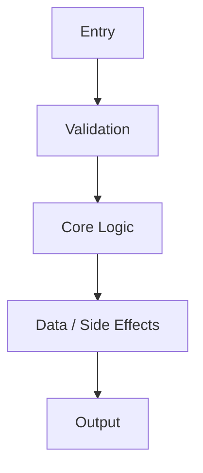
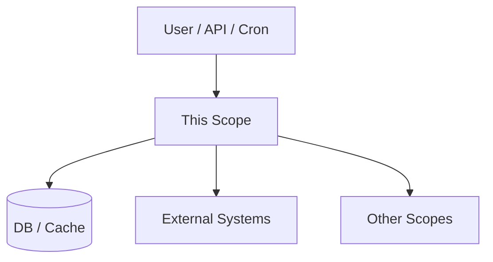
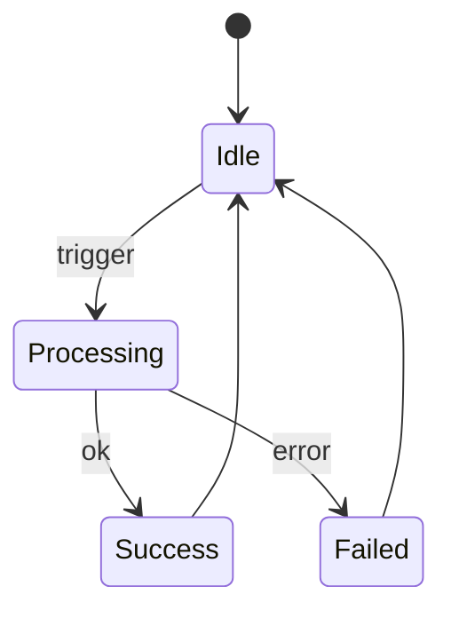
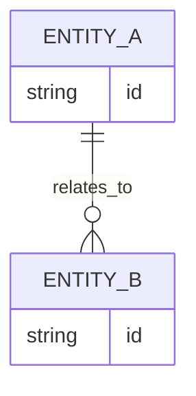
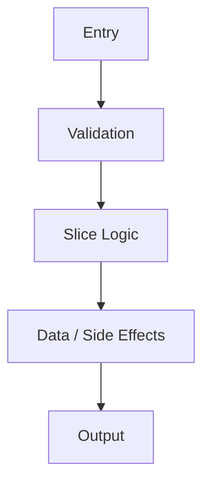
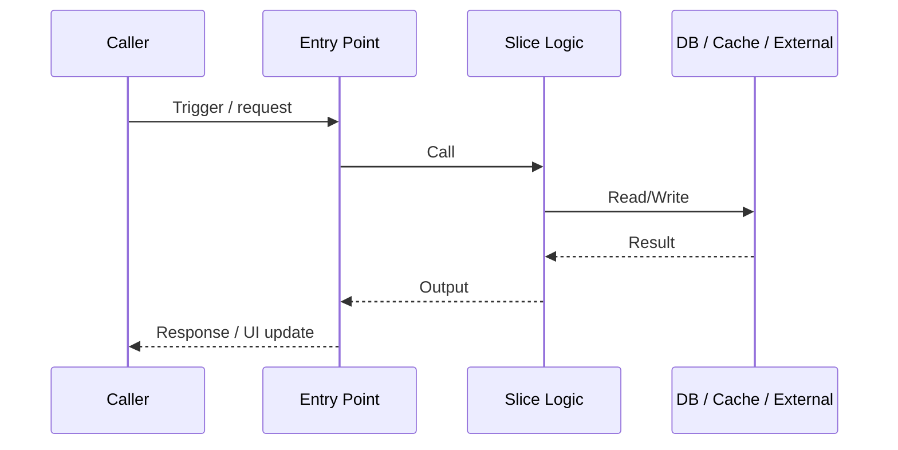
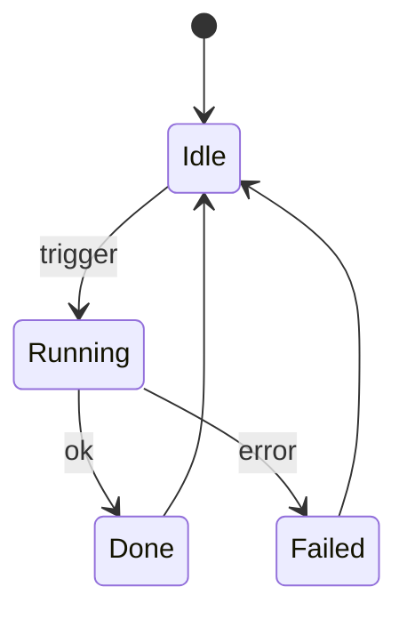
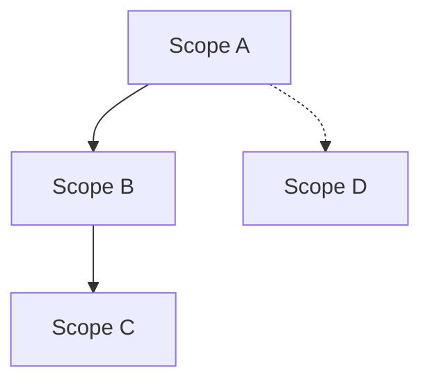

<TEMPLATES>

### 1) CAPABILITY OVERVIEW SCOPE TEMPLATE (Router)
**File:** `Scopes/Product/<Area>/<Capability>.md`
**Rule:** Keep this file short; push details into micro scopes. Diagrams are encouraged: include all diagrams that are actually useful, and delete the ones that don’t apply.

````markdown
# <Capability Name>

## Summary
1–3 sentences describing what this capability does today based on observable code.

## Where to Start in Code
Fast entry points for future readers (no speculation; evidence-backed):
- **Primary entrypoint(s)**: `[path:Lx-Ly](path#Lx-Ly)`
- **Key orchestrator/service**: `[path:Lx-Ly](path#Lx-Ly)`
- **Core data model / schema** (if applicable): `[path:Lx-Ly](path#Lx-Ly)`
- **Primary UI surface** (if applicable): `[path:Lx-Ly](path#Lx-Ly)`

## Sub-Scopes (Smaller, Linked)
These files split the capability into smaller slices. Fill them first, then keep this file as the router.
- [<Capability>: <Micro Scope>](./<Capability>/<MicroScope>.md) — one-line purpose

## What Happens (High-Level)
Inputs → Processing → Outputs.

## Diagrams (Mermaid)
Rules:
- Diagrams must match observable repo evidence (entrypoints, traces, wiring). No vibes.
- Never leave placeholder diagrams unchanged. Update them or delete them.
- Minimum for router scopes: Core Flow + Dependencies + one Sequence (happy path).
- Add State/Data diagrams only when the capability is stateful or has stable persisted entities.

### Core Flow (High-Level)


### Dependencies / Boundaries


### Happy Path Sequence (One End-to-End Trace)
```mermaid
sequenceDiagram
  participant Actor as Actor
  participant Entry as Entry Point
  participant Svc as Service / Use Case
  participant Data as DB / Cache / External
  Actor->>Entry: Trigger / request
  Entry->>Svc: Call w/ validated input
  Svc->>Data: Read/Write
  Data-->>Svc: Result
  Svc-->>Entry: Output
  Entry-->>Actor: Response / UI update
```

### State Model (If Stateful; Otherwise Delete)


### Data Model (If Applicable; Otherwise Delete)


## Scope Network (Cross-links)
- **Children (micro scopes)**
  - [<Capability>: <Micro Scope>](./<Capability>/<MicroScope>.md)
- **Depends on / Uses (Upstream)**
  - [Scope Name](path.md) — evidence: `[path:Lx-Ly](path#Lx-Ly)`
- **Used by / Downstream**
  - [Scope Name](path.md) — evidence: `[path:Lx-Ly](path#Lx-Ly)`

## Confidence & Notes
- **Confidence**: High / Medium / Low
- **Notes**: ambiguity, missing links, or conflicts.
````

---

### 1b) MICRO SCOPE FILE TEMPLATE (Small Slice)
**File:** `Scopes/Product/<Area>/<Capability>/<MicroScope>.md`
**Rule:** Keep micro scopes lean. Prefer diagrams over prose when they add clarity.

````markdown
# <Capability>: <Micro Scope>

## Summary
1–2 sentences describing this slice of behavior.

## Where to Start in Code
- **Primary entrypoint(s)**: `[path:Lx-Ly](path#Lx-Ly)`
- **Key file(s)**: `[path:Lx-Ly](path#Lx-Ly)`

## Diagrams (Mermaid)
Rules:
- Diagrams must match the trace + evidence links below.
- Delete any diagram that doesn’t apply. Never leave placeholders unchanged.

### Slice Flow


### Slice Sequence (From One Real Trace)


### State Model (Optional; Delete If Not Stateful)


## Usage & Flow Traces
At least one end-to-end trace for this micro-scope.

| Step | Layer | Evidence Link | Description |
|------|-------|---------------|-------------|
| 1 | Entry | [path:Lx-Ly](path#Lx-Ly) | Trigger received |
| 2 | Validation | [path:Lx-Ly](path#Lx-Ly) | Validation/authorization |
| 3 | Logic | [path:Lx-Ly](path#Lx-Ly) | Core processing |
| 4 | Data | [path:Lx-Ly](path#Lx-Ly) | Storage/network side effects |
| 5 | Output | [path:Lx-Ly](path#Lx-Ly) | Response/UI update |

## Rules & Failure Outcomes
- **Rule / constraint**: <rule>
  - **Evidence**: `[path:Lx-Ly](path#Lx-Ly)`
- **Failure mode**: <failure>
  - **Evidence**: `[path:Lx-Ly](path#Lx-Ly)`

## Evidence Index
| Evidence Link | What it proves |
|--------------|-----------------|
| [path:Lx-Ly](path#Lx-Ly) | <claim proven> |

## Links
- **Parent**: [<Capability>](../<Capability>.md)
- **Siblings**
  - [<Capability>: <Sibling>](./<Sibling>.md)

## Confidence & Notes
- **Confidence**: High / Medium / Low
- **Notes**: ambiguity, missing links, or conflicts.
````

---

### 2) INDEX.md TEMPLATE
**File:** `Scopes/INDEX.md`

````markdown
# Project Scopes (System Encyclopedia)

## Purpose
What this documentation set is and how to use it.

## Start Here (Top 3–7 Scopes)
- [Scope Name](path) — one-line summary

## Scope Tree
- [Product](./Product/README.md) (optional)
- [Root Scope](path)
  - [Child Scope](path)

## Meta
- [Network Graph](./GRAPH.md)
- [Glossary](./GLOSSARY.md) (optional)
- [Tech Stack](./Onboarding/TECH_STACK.md)
- [Code Style & Engineering Standards](./Work/Standards/WRITE_STYLE.md)
````

---

### 3) GRAPH.md TEMPLATE
**File:** `Scopes/GRAPH.md`

````markdown
# Scope Network Graph

## Legend
- `-->` Depends On / Uses
- `-.->` Possible Relation (Low confidence)

## Graph


## Evidence Table
| From | To | Relationship | Evidence Link |
|------|----|--------------|---------------|
| A | B | Calls API | [path:L10-L20](path#L10-L20) |
````


---

### 4) DEVELOPER_INFO.md TEMPLATE
**File:** `Scopes/DEVELOPER_INFO.md`

````markdown
# Developer Info & Commands

## Quick Start
- **Install**: `command` (`[source]`)
- **Run Locally**: `command` (`[source]`)
- **Build**: `command` (`[source]`)

## Test Commands
| Scope/Area | Command | Source |
|------------|---------|--------|
| All | `npm test` | `[package.json:L5]` |
| Unit | `npm run test:unit` | `[package.json:L6]` |

## Environment & Setup
- Node Version: ...
- Env Vars: `...`

## Deployment / CI
- ...

## References
List external documentation you relied on while writing/verifying the commands above.
Keep entries short: link + one-line reason.
````

---

### 5) WRITE_STYLE.md TEMPLATE
**File:** `Scopes/Work/Standards/WRITE_STYLE.md`

````markdown
# Code Style & Engineering Standards

## Why this exists
Keep engineering changes consistent, maintainable, and easy to review. Reduce duplication and bias toward reuse.

## Defaults (use these unless you have a reason not to)
- **Less code = better work**: prefer deletion, reuse, and small changes over new abstractions.
- **Prefer reuse over reimplementation**: search for existing utilities/services before adding new ones.
- **Single source of truth**: if logic is shared, centralize it; avoid copy/paste across areas.
- **Follow the grain**: adopt existing conventions in the repo (naming, structure, libraries) unless there’s a clear payoff.

## Code style (common practice)
- **Readability first**: optimize for the next engineer reading this in 6 months.
- **Naming**: use domain terms; avoid abbreviations; booleans read like predicates (`isEnabled`, `hasAccess`).
- **Functions**: single responsibility; prefer early returns; avoid deep nesting; keep parameters minimal.
- **Errors**: handle failures explicitly; don’t swallow errors; include actionable context in messages.
- **Boundaries**: validate inputs at the edges (API/UI/IO boundaries), keep core logic pure where possible.
- **Comments**: explain “why” and tradeoffs; delete stale comments; prefer self-explanatory code.
- **Formatting**: let the repo formatter/linter win; don’t introduce bespoke formatting rules.

## Design & patterns (pick intentionally)
- **Composition over inheritance**: keep building blocks small and swappable.
- **Functional core, imperative shell**: isolate IO (DB/network/files) from pure business logic.
- **Adapter at boundaries**: map external shapes (HTTP/DB/vendor) into internal domain models once.
- **GoF vocabulary (optional)**: use consistent pattern names + tradeoffs (`../../_shared/GOF_PATTERNS.md`) when it helps communication; don’t cargo-cult patterns.
- **Small interfaces**: depend on minimal contracts; avoid “god” services/modules.
- **Consistency beats cleverness**: prefer the repo’s established patterns over novelty.

## Testing & change discipline
- **Make the smallest behavior change** that satisfies the requirement and is backed by tests.
- **Avoid overspecified tests**: assert outcomes, not internal steps (unless it’s a true contract).
- **Refactor after green**: remove duplication and clarify names once behavior is proven.

## Scope docs hygiene (minimal)
- **Evidence-first**: capability claims belong in `Scopes/Product/**` and must have evidence links.
- **Avoid duplication**: link to related Scopes instead of repeating explanations.

## Area-specific notes (optional)
Add short sections only when an Area has stable conventions that are repeatedly used.

## References
List external documentation used to justify standards in this file (link + one-line reason).
````

</TEMPLATES>

---

### 6) TECH_STACK.md TEMPLATE
**File:** `Scopes/Onboarding/TECH_STACK.md`

````markdown
# Tech Stack Inventory

## Summary
Evidence-backed “what we use” overview (no speculation).

## Languages & Runtimes
- **<Language/Runtime>**: what it’s used for
  - **Evidence**: `[path:Lx-Ly](path#Lx-Ly)`

## Frameworks & Major Libraries
Only list “major” dependencies (ones shaping architecture or used broadly).
- **<Library>**: where/how it’s used
  - **Evidence**: `[path:Lx-Ly](path#Lx-Ly)` (dependency) + `[path:Lx-Ly](path#Lx-Ly)` (usage)
  - **Docs**: <external link> — one-line reason it’s relevant

## Tooling (Build / Test / Lint / CI)
- **<Tool>**: purpose + where configured
  - **Evidence**: `[path:Lx-Ly](path#Lx-Ly)`
  - **Docs**: <external link> — one-line reason it’s relevant

## “Why these choices?”
Only include rationale if explicitly documented; otherwise mark `[Unknown]`.
- **<Choice>**: <reason or `[Unknown]`>
  - **Evidence** (if available): `[path:Lx-Ly](path#Lx-Ly)`

## References
External docs used while writing this inventory (link + one-line reason).
````
