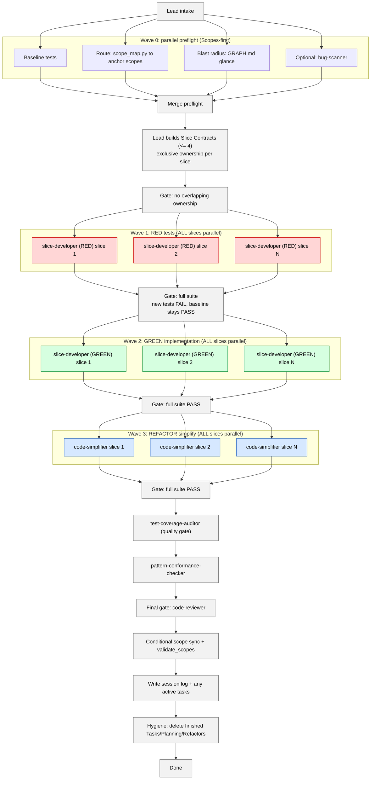

# Developing (TDD) — Parallel Phase-Gated TDD

You implement features using strict TDD with **parallel agents per phase**. The lead orchestrates 3 phases (RED → GREEN → REFACTOR), each running agents in parallel, with the test suite as the gate between phases.

## When to use this skill
Use when you need to implement something with new tests. If no new tests are needed (just running existing ones), use `developing-verified` instead.

## Example prompts
- "Add a regression test for this bug and fix it."
- "Implement feature X with strict TDD."
- "Write failing tests first, then make them pass."

## Prerequisites
- The repo has a working test runner (from `Scopes/DEVELOPER_INFO.md` or detectable).
- Permission to create/modify test files.
- **Parallel subagents are MANDATORY**: the environment MUST support spawning multiple subagents in a single batch. Sequential fallback is not permitted. See `skills/_shared/SCOPES_PROTOCOL.md`.
- Read `skills/_shared/SCOPES_PROTOCOL.md` and `skills/_shared/DEVELOPING_PROTOCOL.md`.

## Mission Start
Load and follow the shared protocols:
- `skills/_shared/SCOPES_PROTOCOL.md` (Scopes-first startup)
- `skills/_shared/DEVELOPING_PROTOCOL.md` (verification-first loops)
- `skills/_shared/SLICE_CONTRACT.md` (delegation format)
- `skills/_shared/SESSION_LOG_TEMPLATES.md` (session log structure for TDD)
Design patterns (practical subset in implementation; recognize full GoF catalog to avoid misapplication):
- `skills/_shared/GOF_PATTERNS.md`

Resolve `SKILLS_ROOT` using the shared snippet:
- `skills/_shared/SCRIPT_DISCOVERY.md`

---

## Architecture (Wave Model)



---

## Workflow

### Step -1: Upstream Artifact Intake (mandatory check)

When invoked from a task file, read the task's anchor scope, pattern reference, verification command, and acceptance examples directly. Use the task's `## Ownership` section as the slice's `impl_files`. **SKIP scope_map routing** (Lane B below). If invoked freestanding (no upstream task), proceed to Step 0 normally.

(See `skills/_shared/SCOPES_PROTOCOL.md` → Upstream Artifact Intake.)

---

### Step 0: Preflight (orchestrator, < 3 min)

These checks are independent. **Run them in parallel** (spawn all in one batch); merge the outputs. Parallel execution is mandatory for this skill (see SCOPES_PROTOCOL).

**Lane A: Baseline** — Run existing tests:
```bash
<test_command>
```
Record: `baseline = PASS | FAIL (N failures)`.

**Lane B: Route** — Find anchor scope(s):
```bash
python3 "$SKILLS_ROOT/syncing-scopes/scripts/scope_map.py" \
  --query "<user goal keywords>" --limit 5 --format json
```

**Lane C: Blast radius (quick)** — Glance `Scopes/GRAPH.md` for downstream dependents of the anchor scope.

**Lane D: Optional bug scan** — If the area is risky or unclear, spawn `bug-scanner` with the anchor scope + likely entrypoints for a fast hotspot/drift check.

**Lane E: Test Harness Check (conditional)** — Runs in parallel with Lanes A-D. If the repo has no test framework or test files:
1. Set up the minimal test infrastructure: install test runner (from `DEVELOPER_INFO.md` or detect), create test directory structure, write one trivial passing test to verify the harness.
2. Record the test command in the session log.
3. Once verified, harness is ready for Step 1 (Slice).

**Merge:** anchor scope(s) + baseline + blast radius (+ optional scan) + harness status captured.

---

### Step 1: Slice (orchestrator only, < 5 min)

Break the user's goal into **independent behavior slices**. Each slice becomes a Slice Contract for the agents:

```json
{
  "slice_id": "slice-1",
  "behavior": "<one testable behavior>",
  "acceptance_examples": [
    "Given X, when Y, then Z"
  ],
  "test_file": "<path where the test should be written>",
  "impl_files": ["<files the agent may edit to implement>"],
  "anchor_scope": "<path from Step 0>",
  "test_command": "<specific test command for this slice>",
  "pattern_reference": "<path to existing similar implementation>"
}
```

**Rules:**
- Each slice = one testable behavior (2-5 acceptance examples)
- Slices MUST be **independent** — no shared file edits across slices
- Each slice has **exclusive file ownership**: test file + impl files
- If two slices need to edit the same file → merge them into one slice

**Max slices per batch:** 4 (queue the rest for the next cycle)

**Single-slice fast-path:** IF only 1 slice → the lead implements the RED/GREEN/REFACTOR phases directly without spawning subagents. Still run `code-reviewer` as the final gate.

---

### Step 2: RED Phase — Write Failing Tests (parallel agents)

⚠️ **Spawn ALL `slice-developer` agents in a SINGLE tool-call batch.**

For each slice, spawn a `slice-developer` subagent (see `agents/slice-developer.md`):

> **SLICE CONTRACT — RED PHASE**
> - **phase**: `RED`
> - **Target**: Write failing test(s) for: {behavior}
> - **Ownership**: You may ONLY create/edit: {test_file}
> - **Acceptance examples**: {acceptance_examples}
> - **Pattern reference**: Follow the test patterns in {pattern_reference}
> - **Guard**: After writing, run `{test_command}` — tests MUST FAIL
> - **⛔ DO NOT write implementation code.** Only test code.
> - **Artifact**: Return JSON receipt per `slice-developer` output contract

Wait for ALL agents to complete.

**GATE: Orchestrator runs tests**
```bash
<full_test_command>
```

**Verify:**
- All NEW tests FAIL (expected — no implementation yet)
- All BASELINE tests still pass (no regressions)
- If a new test passes unexpectedly → it's testing existing behavior, not new. Remove or rethink it.
- If a baseline test broke → an agent edited the wrong file. Fix ownership and re-run.

✅ Gate passes → proceed to GREEN
❌ Gate fails → route failures back to the responsible agent(s), re-run RED for those slices only

---

### Step 3: GREEN Phase — Make Tests Pass (parallel agents)

⚠️ **Spawn ALL `slice-developer` agents in a SINGLE tool-call batch.**

For each slice, spawn a `slice-developer` subagent (see `agents/slice-developer.md`):

> **SLICE CONTRACT — GREEN PHASE**
> - **phase**: `GREEN`
> - **Target**: Write minimal code to make these tests pass: {test_file}
> - **Ownership**: You may ONLY edit: {impl_files}. Do NOT edit the test file.
> - **Acceptance examples**: {acceptance_examples}
> - **Pattern reference**: Follow implementation patterns in {pattern_reference}
> - **Guard**: After implementing, run `{test_command}` — tests MUST PASS
> - **⛔ MINIMAL code only.** No over-engineering. No extra features.
> - **Artifact**: Return JSON receipt per `slice-developer` output contract

Wait for ALL agents to complete.

**GATE: Orchestrator runs full test suite**
```bash
<full_test_command>
```

**Verify:**
- All NEW tests PASS
- All BASELINE tests still pass
- If some new tests still fail:
  → Spawn fix agents for ONLY the failing slices (same contract, add the error output as context)
  → ADD to the fix contract: the test file content (so the fix agent understands what's expected)
  → ADD to the fix contract: the RED agent's acceptance examples
  → Re-gate after fixes
  → Max 3 fix cycles per slice before escalating to user

✅ Gate passes → proceed to REFACTOR
❌ After 3 fix cycles still failing → set `Verdict: Blocked`, report which slices failed + error output

---

### Step 4: REFACTOR Phase — Simplify (parallel agents)

⚠️ **Spawn ALL simplifier agents in a SINGLE tool-call batch.**

For each slice, spawn a `code-simplifier` subagent:

> **SLICE CONTRACT — REFACTOR PHASE**
> - **Target**: Simplify the code changed in slice: {slice_id}
> - **Ownership**: {impl_files + test_file} — you may edit both implementation and test code
> - **Guard command**: `{test_command}` — run after every simplification
> - **Acceptance**: All tests still pass. Code is cleaner. No behavior change.
> - **Artifact**: Return JSON: `{ "slice_id": "...", "files_simplified": N, "lines_removed": N, "guard_result": "PASS", "files_read": [...], "key_findings": [...] }`

Wait for ALL agents to complete.

**GATE: Orchestrator runs full test suite**
```bash
<full_test_command>
```

**Verify:**
- All tests PASS (refactoring must not break anything)
- If a test broke → spawn a fix agent for that slice with the error output
- Re-gate after fix

✅ Gate passes → proceed to Final Gate

---

### Step 5: Final Gate (orchestrator only)

1. **Full test suite** one last time:
   ```bash
   <full_test_command>
   ```

2. Spawn **3 quality-gate agents in a SINGLE tool-call batch** (parallel):

   **Agent 1: `test-coverage-auditor`** (see `agents/test-coverage-auditor.md`):
   > **SLICE CONTRACT**
   > - **Target**: Audit test quality for slices: {slice_list}
   > - **Ownership**: Read-only review of {test_files + impl_files from all slices}
   > - **Context**: Anchor scope at `{anchor_scope_path}`, acceptance examples from slice contracts
   > - **Acceptance**: Map acceptance examples to tests. Report behavioral coverage gaps rated >= 7.
   > - **Artifact**: Return JSON receipt per `test-coverage-auditor` output contract

   **Agent 2: `pattern-conformance-checker`** (see `agents/pattern-conformance-checker.md`):
   > **SLICE CONTRACT**
   > - **Target**: Verify pattern conformance of all changes from this TDD session
   > - **Ownership**: Read-only review of {impl_files from all slices}
   > - **Context**: Anchor scope, pattern references from slice contracts
   > - **Acceptance**: Report deviations from established repo patterns
   > - **Artifact**: Return JSON receipt per `pattern-conformance-checker` output contract

   **Agent 3: `code-reviewer`** (see `agents/code-reviewer.md`):
   > **SLICE CONTRACT**
   > - **Target**: Review all changes from this TDD session
   > - **Ownership**: Read-only review of {all files from all slices}
   > - **Context**: Anchor scope at `{anchor_scope_path}`, slices: `{slice_list}`
   > - **Acceptance**: Report only findings with confidence >= 80. Include drift detection.
   > - **Artifact**: Return JSON receipt per `code-reviewer` output contract

3. **Merge gate receipts.** IF any agent reports high-severity issues:
   - Spawn `slice-developer` (phase: `FIX`) for the affected files
   - Re-run the failing gate agent(s) only
   - Max 2 fix cycles before escalating to user

---

### Step 6: Scope Sync (conditional, automatic)

```bash
git diff --name-only | xargs -I{} rg -l "{}" Scopes/Product/ 2>/dev/null
```

**IF output is non-empty** (scope-linked files changed):
1. Update affected scope(s) — refresh evidence links, update traces
2. Run: `python3 "$SKILLS_ROOT/syncing-scopes/scripts/validate_scopes.py" --all`

**ELSE:** Skip scope update entirely.

---

### Step 7: Leave Durable Artifacts (mandatory)

1. **Session log**: finalized at `Scopes/Work/STDD/<session-slug>.md`

Per slice entry:
```markdown
### Slice: <behavior name>
- **Phase results**: RED ✅ → GREEN ✅ → REFACTOR ✅
- **Tests added**: <list>
- **Files changed**: <list>
- **Fix cycles**: <0-3>
- **Decision**: <what design choice was made>
- **Follow-ups**: <parking lot items>
```

2. **Parking lot** items → converted to task files at `Scopes/Work/Tasks/` (only for remaining work; tasks are not an archive)
3. **Context summary**: if the session was tool-heavy (>10 tool calls), invoke `context-summarizer`

---

### Step 8: Maintenance / Hygiene (mandatory)

`Scopes/Work/Tasks/` should contain only **active** work.
- Delete task files that were completed in this session.
- If you executed a plan/refactor plan artifact as part of this work, delete the executed artifact and keep a short durable completion note instead.
- Keep: updated Scopes + session log (+ ADR/Notes as needed).

---

## File Ownership Rules

⛔ **These rules prevent agent conflicts:**

1. Each slice has a declared `test_file` and `impl_files` list
2. No two slices may share ANY file in their ownership lists
3. If a shared file is needed → merge those slices into one
4. The orchestrator ONLY runs tests and reads output — it does NOT edit owned files
5. Agents may NOT edit files outside their ownership list

---

## Blocked Runbook
- Tests fail unexpectedly (not from your changes): record baseline failures; exclude them; continue.
- No test runner found and can't install: set `Verdict: Blocked`, explain why.
- Agent conflict (two agents edited same file): merge the conflicting slices, re-run from RED.
- Fix cycle exhausted (3 attempts): set `Verdict: Blocked`, report failing tests + error output.
- Scope navigation fails (no Scopes/): focus on code; note `Scopes sync needed` in artifacts.

## Output Contract

Return <= 20 lines:

```markdown
## TDD
Verdict: Proceed | Blocked | Needs Sync | Needs Narrowing
Decision: <one sentence summary>
Slices Completed: <N> / <Total>
Phases: RED(<N> agents) → GREEN(<N> agents) → REFACTOR(<N> agents)
Fix Cycles: <N total across all slices>
Tests Added: <N>
Files Changed: <list>
Reviewer Verdict: <PASS | findings summary>
Scope Impact: <scopes updated or "None">
Artifact: Scopes/Work/STDD/<session-slug>.md
Next: <one action>
```
