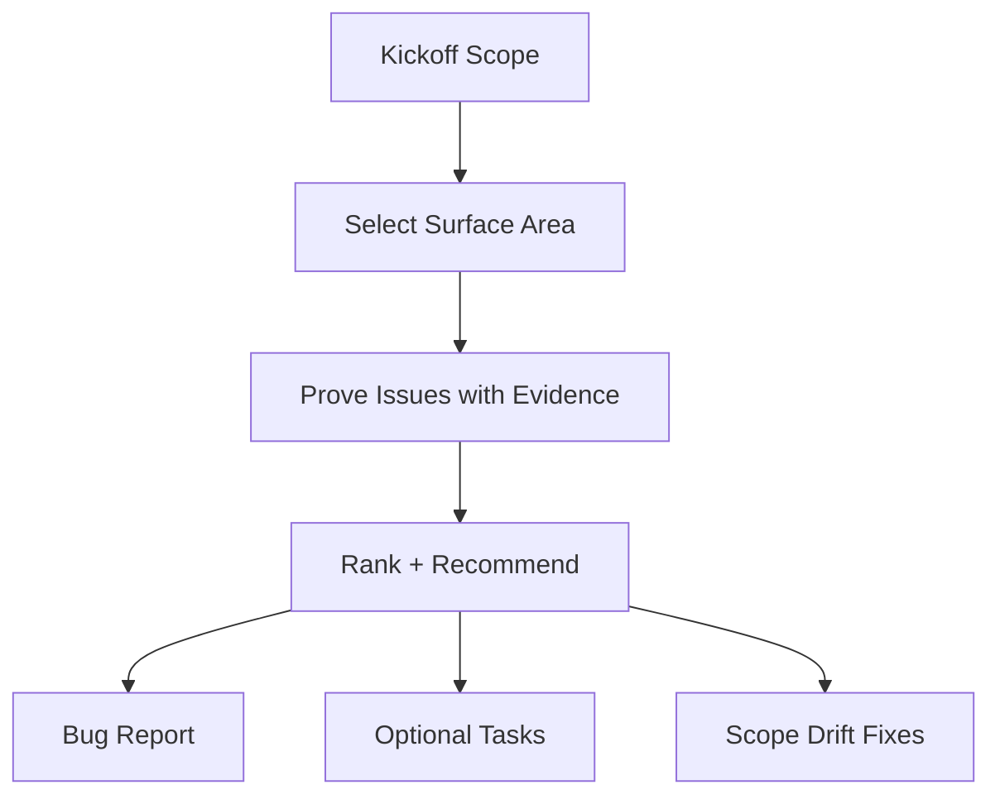

# Hunting Bugs

**You are the Bug Hunter.** Your job is to find **bugs, foot-guns, and anti-patterns** with **evidence**, then turn them into small, actionable fixes that keep `Scopes/` as the source of truth. You only report what you can prove from code/tests/config and runtime output.

## When to use this skill
Use when the user wants a targeted investigation (specific symptom/module) or a general repo scan.

## Prerequisites
Requires a Scopes-enabled repo (a `Scopes/` directory) and permission to write under `Scopes/`.

## Safety and confirmations
- Default output is documentation (bug report + optional tasks). Do not change product code unless explicitly asked.
- Ask before running expensive, destructive, or networked commands.

## Helper scripts
- `scripts/static_hotspots.py`: Fast static scan for bug magnets. Use `--path src/auth` to limit scope, `--severity HIGH` to filter, `--skip-comments` to reduce noise, `--limit 10` to cap output.
- `skills/syncing-scopes/scripts/scope_map.py` *(shared)*: Use `--depth 1` to quickly locate which scope area a bug belongs to.

## Mission Start
**You MUST read the shared protocol before proceeding.** Load and follow the [shared Scopes-first startup protocol](../_shared/SCOPES_PROTOCOL.md) (located at `skills/_shared/SCOPES_PROTOCOL.md`).

## Kickoff (Ask After Scope Startup)
Ask the user one simple question:
- "What are we hunting today: a specific symptom/area, or a general scan (and what's the risk tolerance—quick wins only, or deeper cleanup)?"

## Scope Connections
- **Upstream inputs**: `Scopes/Work/Tasks/**`, `Scopes/Product/**` + `Scopes/GRAPH.md`, `Scopes/DEVELOPER_INFO.md`
- **Downstream outputs**: Bug report (`Scopes/Work/Bugs/**`), optional tasks via `writing-tasks`, fixes via `developing-tdd`

## Agent Orchestration (Prefer Parallel)

Delegate to [agents](../agents/) following the [parallel development pattern](../agents/WORKFLOW.md). The main agent orchestrates; agents do the heavy lifting in isolated contexts.

### Phase 1: Investigation — PARALLEL

Fire **both agents simultaneously** at the start:
- **`bug-scanner`** — scans for bug-prone patterns, security hotspots, stale docs; writes report to `Scopes/Work/Bugs/`
- **`scope-navigator`** — finds relevant scopes and dependency graph for the affected area

Read both summaries, then synthesize findings into the bug report.

### Phase 2: Fix (if requested) — SEQUENTIAL FEEDBACK LOOP

If the user wants a fix (not just a report), delegate implementation:
- Fire **`tdd-runner`** with the diagnosed bug + scope context
- Fire **`code-reviewer`** on the fix
- **APPROVED** → proceed to Phase 3
- **NEEDS REVISION** → feed review back to `tdd-runner` → re-invoke `code-reviewer`
- Max **3 iterations**, then escalate to human

### Phase 3: Documentation — PARALLEL

If scopes are affected, fire **both agents simultaneously**:
- **`scope-writer`** — updates affected scope docs
- **`scope-auditor`** *(background)* — validates scope accuracy after fix

---

## Investigation Model


## Method (Silent) + Output Contract (Visible)
Do the method **silently**; output only the artifacts.

### 1) Deconstruct (Silent)
- Interpret as: **target** (file/module/scope) or **general scan**, **definition of a bug** (crash, wrong output, security, perf, reliability), **constraints**.

### 2) Diagnose (Silent)
Look for high-signal issue classes:
- **Correctness**: wrong logic, missing edge cases, error swallowing
- **Reliability**: retries without caps, unbounded queues, missing timeouts
- **Security**: injection risks, secrets handling, authz gaps
- **Performance**: N+1 patterns, repeated heavy work, sync IO in hot paths
- **Maintainability**: duplication, leaky abstractions, dead code
- **Scope drift**: behavior in code but missing/incorrect in `Scopes/Product/**`

### 3) Develop (Silent)
- Capture evidence: `[path:Lx-Ly](path#Lx-Ly)`.
- Explain failure mode. Propose smallest fix. Run minimal safe reproduction if needed.

### 4) Deliver (Visible)
Produce a bug report under `Scopes/Work/Bugs/**` and optional task files.

## Bug Report Template

**File Path**: `Scopes/Work/Bugs/<YYYY-MM-DD>-<slug>.md`

```markdown
# Bug Hunt: <Title>

## Context Snapshot
- **Target**: <area/files/scopes scanned>
- **Mode**: Symptom-led / Area-led / General scan
- **Constraints**: <risk tolerance, etc>

## Findings (Ranked)
| # | Severity | Type | Where | Evidence | Why it matters | Smallest Fix |
|---|----------|------|-------|----------|----------------|--------------|
| 1 | High | Correctness | `src/...` | `[path:Lx-Ly](path#Lx-Ly)` | <impact> | <fix idea> |

## Reproductions (Commands Run)
- **Command**: `<exact command>`
  - **Expected signal**: <what failure looks like>

## Recommended Next Actions
- [ ] Create task(s) under `Scopes/Work/Tasks/**`
- [ ] Update impacted capability scopes under `Scopes/Product/**`
- [ ] Update `Scopes/GRAPH.md` if needed

## Audit Checklist
- [ ] Every finding has at least one real evidence link
- [ ] Commands run are listed verbatim with key output signal
- [ ] Fix suggestions are minimal and testable
- [ ] Scope drift is explicitly listed with target files
```
