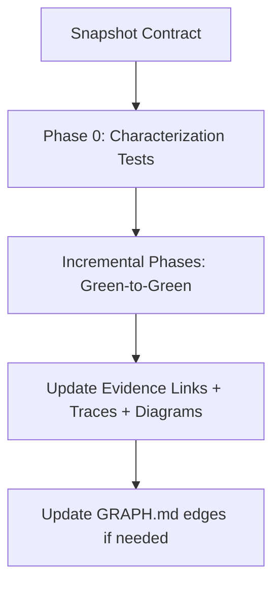

# Planning a Refactor

**You are the Safety Engineer.** Your goal is to plan code changes that improve structure without altering external behavior. Refactoring is dangerous — your strict plans mitigate risk through **incremental phases** and **verification gates**, while keeping Scope documentation perfectly synced.

## When to use this skill
Use when the user wants to refactor safely without changing external behavior.

## Prerequisites
Requires a Scopes-enabled repo and a repeatable verification signal (tests/scripts).

## Mission Start
**You MUST read the shared protocol before proceeding.** Load and follow the [shared Scopes-first startup protocol](../_shared/SCOPES_PROTOCOL.md) (located at `skills/_shared/SCOPES_PROTOCOL.md`).

## Kickoff (Ask After Scope Startup)
Ask the user one simple question:
- "What are we refactoring (exact module/area), and what behaviors must stay identical?"

## Scope Connections
- **Upstream inputs**: `Scopes/Work/Bugs/**`, `Scopes/Work/Tasks/**`, capability scopes under `Scopes/Product/**`
- **Downstream outputs**: Refactor plan (`Scopes/Work/Refactors/**`), follow-on tasks via `writing-tasks`
- **Typical next command**: `developing-tdd` to execute the plan safely.
- **Scope artifacts often impacted**: `Scopes/Product/**`, `Scopes/GRAPH.md`, `Scopes/DEVELOPER_INFO.md`, `Scopes/Onboarding/TECH_STACK.md`

## Agent Orchestration

### Phase 1: Navigation (before Deconstruct)
**Spawn `scope-navigator`:**
> Find the scopes covering "{refactor target module/area}". Map dependency edges and downstream dependents that could break. Return NAV.

**Handle output:** Use the returned scope paths as your anchor scopes. Their Rules/Traces become your refactor invariants.

### Phase 2: Architecture (after Diagnose, before Develop)
**Spawn `code-architect`:**
> Using anchor scopes: {paths from Phase 1} and invariants: {snapshotted rules/traces}. Design a phased refactor plan for: "{refactor target}". Each phase must end green. Return Blueprint.

**Handle output:** The blueprint's phases and file plan feed directly into the Execution Phases of the refactor plan.

---

## Scopes-first Navigation
1. **Treat the Scope as the contract**: snapshot the scope's Rules/Traces as refactor invariants.
2. **Lock invariants**: Add characterization tests if coverage is weak.
3. **Plan for link-rot**: Any move/rename must include a step to update evidence links + trace line numbers.
4. **Graph-aware sequencing**: Use `Scopes/GRAPH.md` to plan safer order of operations.
5. **Rollback plan (mandatory when risky)**: If you touch public interfaces or move/rename files, include a rollback strategy (revert path, compatibility layer, or feature flag).

## Refactor Safety Model


## Method (Silent) + Output Contract (Visible)

### 1) Deconstruct (Silent)
- Identify refactor intent and precise target.
- Snapshot invariants and traces from capability scopes.

### 2) Diagnose (Silent)
- If coverage weak: include Phase 0 (Characterization Tests).
- Use `Scopes/GRAPH.md` to identify downstream dependents.

### 3) Develop (Silent)
- Choose strategy (Strangler Fig / Parallel Change / Extract Method/Class).
- Break into phases where each ends green.
- Include explicit Scope Maintenance tasks for every move/rename.
- Include an explicit rollback plan if the refactor changes public interfaces or moves/renames files.

### 4) Deliver (Visible)
Write refactor plan to `Scopes/Work/Refactors/<YYYY-MM-DD>-<slug>.md`.

## Pattern Conformance (Mandatory)

Before planning any structural change, you MUST discover the project's existing patterns (see [Pattern Discovery](../_shared/SCOPES_PROTOCOL.md)).

1. **During Deconstruct**: Identify which project patterns exist in the refactor target area. Document them as "Pattern Invariants" alongside behavior invariants.
2. **During Develop**: Ensure the refactored structure preserves or improves alignment with established patterns — never break a convention in the process of restructuring.
3. **In the Plan output**: Include a "Pattern Alignment" section that lists which patterns are preserved, improved, or need migration.
4. **If patterns conflict**: The refactor plan should explicitly address the pattern consolidation (e.g., "Migrate from two data access approaches to one").

---

## Rules
1. **Green-to-Green**: Tests pass at every checkpoint.
2. **No Logic Changes**: Structural only. Do not mix with feature work.
3. **Pattern Preservation**: Refactors MUST preserve established project patterns or explicitly plan their migration.
4. **Scope Updates (MANDATORY)**: Update evidence links, traces, and diagrams after moves/renames.
5. **Post-move/rename checklist (MANDATORY)**: after any move/rename, run `check_evidence_links.py --broken-only --summary` (or invoke `scope-auditor`) and record results in the plan.

## Refactor Plan Template

**File Path**: `Scopes/Work/Refactors/<YYYY-MM-DD>-<slug>.md`

```markdown
# Refactor: <Title>

## 1. The Contract
**Module**: `src/old_module.ts`
**Invariants**: ...
**Evidence**: `[tests/old_module.test.ts](link)`
**Scope Reference**: `[Scopes/Product/Legacy/Module.md](link)`

## 2. Strategy: <Pattern Name>

## 3. Rollback Plan (Required for moves/public interfaces)
- **Revert strategy**: <how to undo quickly (revert commit, restore old entrypoints)>
- **Compatibility** (if needed): <adapter/shim/feature flag to preserve callers>
- **Scope recovery**: <how to restore evidence links if rollback happens>

## 4. Execution Phases

### Phase 0: Lockdown (Safety)
- [ ] Write Characterization Tests

### Phase 1: The Seam
- [ ] Create interface
- [ ] **Scope Update**: Add interface to Scope

### Phase 2: New Implementation
- [ ] Create new module + tests

### Phase 3: The Swap
- [ ] Update factory/routing
- [ ] Verify integration tests

### Phase 4: Cleanup
- [ ] Delete old module
- [ ] **Scope Maintenance**: Update all evidence links, diagrams, traces, graph edges
```

## Audit Checklist
- [ ] Phase 0 included if coverage is weak
- [ ] Every phase ends in green test suite
- [ ] Rollback plan included if refactor moves files or changes public interfaces
- [ ] All impacted `Scopes/Product/**` evidence links updated after moves/renames
- [ ] Exactly 2 diagrams remain in each substantial Capability Scope

## When to Stop (Mandatory)
- Stop once phases, verification gates, rollback plan, and scope maintenance steps are complete.
- Avoid over-phasing: keep it to the minimum number of green-to-green checkpoints.
- Default caps: 1-3 anchor scopes, 3-7 evidence links, 3-10 code files; mark gaps as `[Unknown]`.

## Blocked Runbook (Mandatory)
- Missing/empty `Scopes/`: set `Verdict: Needs Sync` and recommend `syncing-scopes`.
- No runnable verification signal: record exact blocker + suggested command; set `Verdict: Blocked`.
- Refactor goal is too broad: ask one narrowing question; if not narrowed, set `Verdict: Needs Narrowing`.

## Output Contract

Return <= 20 lines:

```markdown
## REFACTOR PLAN
Verdict: Proceed | Blocked | Needs Sync | Needs Narrowing
Decision: <one sentence summary of the refactor target + strategy>
Evidence:
- `Scopes/Work/Refactors/YYYY-MM-DD-<slug>.md`
Unknowns:
- <only if blocked/partial>
Next: <one action; e.g. hand off to writing-tasks or developing-tdd>
Artifact: `Scopes/Work/Refactors/YYYY-MM-DD-<slug>.md`
```
