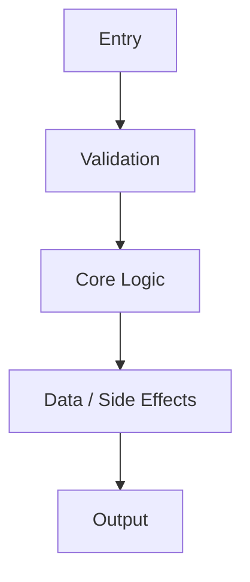
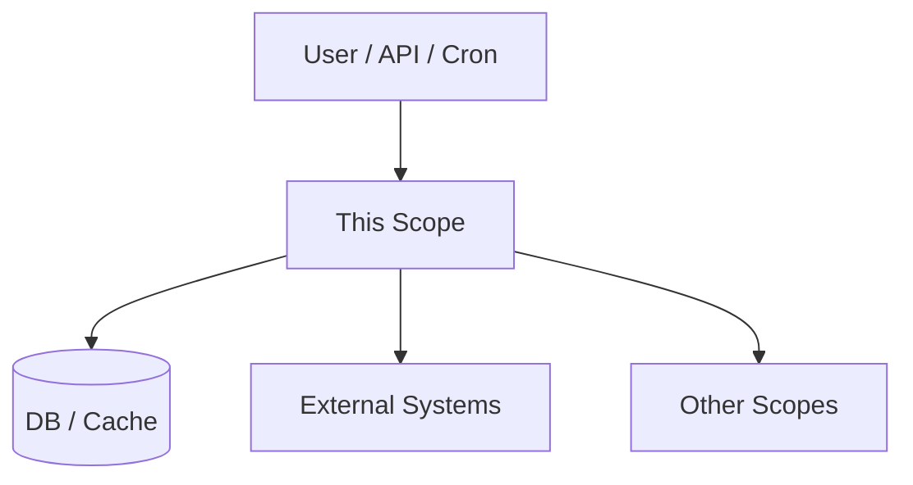
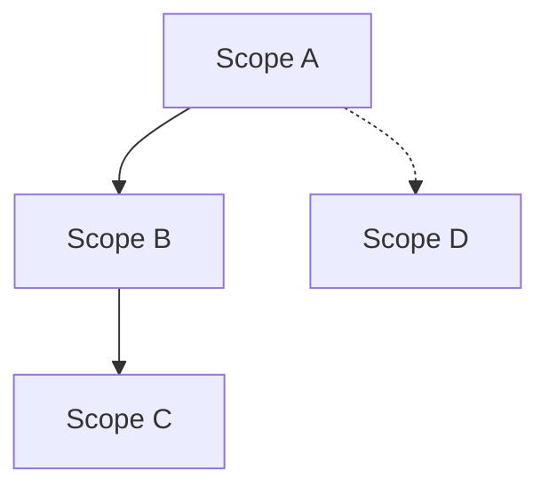

<TEMPLATES>

### 1) CAPABILITY SCOPE FILE TEMPLATE
**Filename (preferred):** `Scopes/Product/<Area>/<Capability>.md`
**Alternate:** `Scopes/Product/<Area>/<Capability>/<SubCapability>.md`
**Rule:** Follow this structure exactly.

```markdown
# <Scope / Capability Name>

## Summary
1–3 sentences describing what this scope does today based on observable code.

## Where to Start in Code
Fast entry points for future readers (no speculation; evidence-backed):
- **Primary entrypoint(s)**: `[path:Lx-Ly](path#Lx-Ly)`
- **Key orchestrator/service**: `[path:Lx-Ly](path#Lx-Ly)`
- **Data layer / schema** (if applicable): `[path:Lx-Ly](path#Lx-Ly)`
- **UI surface** (if applicable): `[path:Lx-Ly](path#Lx-Ly)`

## Tech Stack & Skills (Evidence-backed)
What this capability uses, how it’s used, and (only if explicitly documented) why.

### Libraries / Tools Used
List the major libraries/tools directly involved in this capability.
Each bullet MUST include evidence.
- **<Library/Tool>**: what it does here
  - **Evidence**: `[path:Lx-Ly](path#Lx-Ly)` (dependency/config/usage)
  - **Docs**: <external link> — one-line reason it’s relevant

### How It’s Used (Integration Points)
Point to the concrete integration points for this capability.
- **<integration point>**: `[path:Lx-Ly](path#Lx-Ly)` — one-line description

### Skills You Need (Grounded in the above)
List the practical skills/concepts an engineer needs to work on this capability, grounded in the libraries/tools actually used here.
- **<Skill>**: tied to <Library/Tool> or <integration point>

### Why This (Only if explicitly documented)
- **Rationale**: <reason or `[Unknown]`>
  - **Evidence** (if available): `[path:Lx-Ly](path#Lx-Ly)` (ADR/README/etc)

### References
External docs you relied on while interpreting this capability (link + one-line reason).

## Users & Triggers
Who initiates this? (User action, API client, cron, system event)

## What Happens
High-level flow: Inputs → Processing → Outputs.

## Rules & Constraints
System-enforced rules (validation, permissions, limits).
Each bullet MUST have evidence.

## Edge Cases & Failure Outcomes
Error states, retries, fallbacks, empty states.

## Use Cases
List 3–7 concrete “user stories” that are true today, each linked to evidence.
- **Use case**: <short>
  - **Trigger**: <what starts it>
  - **Outcome**: <what user/system gets>
  - **Evidence**: `[path:Lx-Ly](path#Lx-Ly)`

<!-- SECTION: UI SURFACE (Only for UI Pages/Components) -->
<!-- Remove this section if backend-only -->
## UI Surface

### Page Identity
- **Route / Path**: `[path:Lx-Ly](path#Lx-Ly)`
- **User Intent**: What is the primary goal here?

### UI Mock (Low-fidelity, Evidence-backed)
Construct an ASCII representation of the UI structure found in code.
Do NOT invent visual details; only include what the JSX/HTML literally shows.

```
+------------------------------------------+
| Header (Evidence: [link])                |
+------------------------------------------+
| [ Input Field ] [ Button ]               |
| (Evidence: [link])                       |
+------------------------------------------+
```

### Interactions & State
- **Navigation**: buttons/links → destinations `[evidence]`
- **Validation**: form rules in code `[evidence]`
- **States**: loading / error / empty `[evidence]`

### Data Binding
- **Displayed Data**: fields shown `[evidence]`
- **Actions**: handlers invoked `[evidence]`
<!-- END UI SECTION -->

## Scope Navigation
- **Parent**: [Name](relative_path.md)
- **Children**
  - [Name](relative_path.md)

## Scope Network (Cross-links)
Every relationship must include evidence, or be placed under “Possible Relations”.

- **Depends on / Uses (Upstream)**
  - [Scope Name](path.md) — utilized via `[path:Lx-Ly](path#Lx-Ly)`
- **Used by / Downstream**
  - [Scope Name](path.md) — consumed via `[path:Lx-Ly](path#Lx-Ly)`
- **Shares Data / Topics**
  - [Scope Name](path.md) — shared via `[path:Lx-Ly](path#Lx-Ly)`
- **Possible Relations (Low Confidence)**
  - [Scope Name](path.md) — explain why evidence is missing and what file you would expect to prove it.

## Diagrams (Mermaid inline) — exactly 2

### Diagram 1: Core Flow


### Diagram 2: Ecosystem / Dependencies


## Usage & Flow Traces
Provide at least one end-to-end trace per major path.

| Step | Layer | Evidence Link | Description |
|------|-------|---------------|-------------|
| 1 | Entry | [path:L10-L15](path#L10-L15) | Trigger received |
| 2 | Validation | [path:L20-L40](path#L20-L40) | Validation/authorization |
| 3 | Logic | [path:L41-L80](path#L41-L80) | Core processing |
| 4 | Data | [path:L81-L110](path#L81-L110) | Storage/network side effects |
| 5 | Output | [path:L111-L140](path#L111-L140) | Response/UI update |

## Code Evidence (Consolidated)
| Evidence Link | What it proves |
|--------------|-----------------|
| [path:Lx-Ly](path#Lx-Ly) | <claim proven> |

## Deep Dives / Sub-capabilities
Merge tiny scopes here. Mini-format: Summary → Trace → Evidence.

## Confidence & Notes
- **Confidence**: High / Medium / Low
- **Notes**: Any ambiguity, missing links, or conflicting signals.
```

---

### 2) INDEX.md TEMPLATE
**File:** `Scopes/INDEX.md`

```markdown
# Project Scopes (System Encyclopedia)

## Purpose
What this documentation set is and how to use it.

## Start Here (Top 3–7 Scopes)
- [Scope Name](path) — one-line summary

## Scope Tree
- [Product](./Product/README.md) (optional)
- [Root Scope](path)
  - [Child Scope](path)

## Meta
- [Network Graph](./GRAPH.md)
- [Glossary](./GLOSSARY.md) (optional)
- [Tech Stack](./Onboarding/TECH_STACK.md)
- [Code Style & Engineering Standards](./Work/Standards/WRITE_STYLE.md)
```

---

### 3) GRAPH.md TEMPLATE
**File:** `Scopes/GRAPH.md`

```markdown
# Scope Network Graph

## Legend
- `-->` Depends On / Uses
- `-.->` Possible Relation (Low confidence)

## Graph


## Evidence Table
| From | To | Relationship | Evidence Link |
|------|----|--------------|---------------|
| A | B | Calls API | [path:L10-L20](path#L10-L20) |
```


---

### 4) DEVELOPER_INFO.md TEMPLATE
**File:** `Scopes/DEVELOPER_INFO.md`

```markdown
# Developer Info & Commands

## Quick Start
- **Install**: `command` (`[source]`)
- **Run Locally**: `command` (`[source]`)
- **Build**: `command` (`[source]`)

## Test Commands
| Scope/Area | Command | Source |
|------------|---------|--------|
| All | `npm test` | `[package.json:L5]` |
| Unit | `npm run test:unit` | `[package.json:L6]` |

## Environment & Setup
- Node Version: ...
- Env Vars: `...`

## Deployment / CI
- ...

## References
List external documentation you relied on while writing/verifying the commands above.
Keep entries short: link + one-line reason.
```

---

### 5) WRITE_STYLE.md TEMPLATE
**File:** `Scopes/Work/Standards/WRITE_STYLE.md`

```markdown
# Code Style & Engineering Standards

## Why this exists
Keep engineering changes consistent, maintainable, and easy to review. Reduce duplication and bias toward reuse.

## Defaults (use these unless you have a reason not to)
- **Less code = better work**: prefer deletion, reuse, and small changes over new abstractions.
- **Prefer reuse over reimplementation**: search for existing utilities/services before adding new ones.
- **Single source of truth**: if logic is shared, centralize it; avoid copy/paste across areas.
- **Follow the grain**: adopt existing conventions in the repo (naming, structure, libraries) unless there’s a clear payoff.

## Code style (common practice)
- **Readability first**: optimize for the next engineer reading this in 6 months.
- **Naming**: use domain terms; avoid abbreviations; booleans read like predicates (`isEnabled`, `hasAccess`).
- **Functions**: single responsibility; prefer early returns; avoid deep nesting; keep parameters minimal.
- **Errors**: handle failures explicitly; don’t swallow errors; include actionable context in messages.
- **Boundaries**: validate inputs at the edges (API/UI/IO boundaries), keep core logic pure where possible.
- **Comments**: explain “why” and tradeoffs; delete stale comments; prefer self-explanatory code.
- **Formatting**: let the repo formatter/linter win; don’t introduce bespoke formatting rules.

## Design & patterns (pick intentionally)
- **Composition over inheritance**: keep building blocks small and swappable.
- **Functional core, imperative shell**: isolate IO (DB/network/files) from pure business logic.
- **Adapter at boundaries**: map external shapes (HTTP/DB/vendor) into internal domain models once.
- **Small interfaces**: depend on minimal contracts; avoid “god” services/modules.
- **Consistency beats cleverness**: prefer the repo’s established patterns over novelty.

## Testing & change discipline
- **Make the smallest behavior change** that satisfies the requirement and is backed by tests.
- **Avoid overspecified tests**: assert outcomes, not internal steps (unless it’s a true contract).
- **Refactor after green**: remove duplication and clarify names once behavior is proven.

## Scope docs hygiene (minimal)
- **Evidence-first**: capability claims belong in `Scopes/Product/**` and must have evidence links.
- **Avoid duplication**: link to related Scopes instead of repeating explanations.

## Area-specific notes (optional)
Add short sections only when an Area has stable conventions that are repeatedly used.

## References
List external documentation used to justify standards in this file (link + one-line reason).
```

</TEMPLATES>

---

### 6) TECH_STACK.md TEMPLATE
**File:** `Scopes/Onboarding/TECH_STACK.md`

```markdown
# Tech Stack Inventory

## Summary
Evidence-backed “what we use” overview (no speculation).

## Languages & Runtimes
- **<Language/Runtime>**: what it’s used for
  - **Evidence**: `[path:Lx-Ly](path#Lx-Ly)`

## Frameworks & Major Libraries
Only list “major” dependencies (ones shaping architecture or used broadly).
- **<Library>**: where/how it’s used
  - **Evidence**: `[path:Lx-Ly](path#Lx-Ly)` (dependency) + `[path:Lx-Ly](path#Lx-Ly)` (usage)
  - **Docs**: <external link> — one-line reason it’s relevant

## Tooling (Build / Test / Lint / CI)
- **<Tool>**: purpose + where configured
  - **Evidence**: `[path:Lx-Ly](path#Lx-Ly)`
  - **Docs**: <external link> — one-line reason it’s relevant

## “Why these choices?”
Only include rationale if explicitly documented; otherwise mark `[Unknown]`.
- **<Choice>**: <reason or `[Unknown]`>
  - **Evidence** (if available): `[path:Lx-Ly](path#Lx-Ly)`

## References
External docs used while writing this inventory (link + one-line reason).
```

