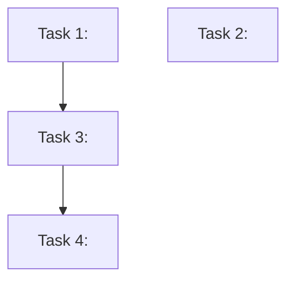

# Writing Tasks — Artifact-Driven Task Generation

You convert plans, ideas, or freestanding requests into engineer-ready task files. When invoked after `planning-idea` or `planning-refactor`, you read the upstream artifact's `## Links` section directly — no redundant scope navigation needed.

## When to use this skill
Use when you need to break down work into task files that developers (or `developing-tdd` / `developing-verified`) can pick up and implement.

## Example prompts
- "Turn this plan into task files with acceptance examples."
- "Break this into 1–4 hour tasks with dependencies."
- "Generate parallelizable tasks where possible."

## Prerequisites
- Ideally: an upstream plan artifact at `Scopes/Work/Planning/**` or `Scopes/Work/Refactors/**`.
- Minimum: a clear user intent plus `Scopes/` documentation.
- **Parallel subagents are MANDATORY** when generating 2+ task files: spawn all in one batch (see `skills/_shared/SCOPES_PROTOCOL.md`). No sequential fallback.
- Read `skills/_shared/SCOPES_PROTOCOL.md`.

## Mission Start
Load `skills/_shared/SCOPES_PROTOCOL.md`.
Load `skills/_shared/SLICE_CONTRACT.md` for understanding how tasks become slice contracts during development.
Design patterns (light vocabulary only; keep naming consistent with upstream artifacts):
- `skills/_shared/GOF_PATTERNS.md`

Resolve `SKILLS_ROOT` using the shared snippet:
- `skills/_shared/SCRIPT_DISCOVERY.md`

---

## Workflow: Artifact-Driven Intake

### Step 0: Intake (zero-navigation when possible)

**IF invoked after a plan artifact** (the plan has a `## Links` section):
1. Read the plan's `## Links` → anchor scopes, pattern references, risks
2. Read the plan's `## TODO Scopes` → work units
3. Read the plan's `## Risk Register` → constraints
4. **SKIP scope navigation entirely** — the plan already did this work

**ELSE (freestanding task request):**
```bash
python3 "$SKILLS_ROOT/syncing-scopes/scripts/scope_map.py" \
  --query "<intent keywords>" --limit 5 --format json
```
Read anchor scopes to build context.

Parallel context lanes (optional):
- Extract plan `## Links` (if present) for anchor scopes + pattern refs.
- Route to anchor scopes (if no plan).
- Identify the narrowest verification command from `Scopes/DEVELOPER_INFO.md`.
Merge into one context bundle before slicing.

---

### Step 1: Slice into Work Units (deterministic)

Break the intent into **work units**, each 1-4 hours of implementation work.

Each work unit becomes a task file. Each task IS a future Slice Contract for `developing-tdd` or `developing-verified`:

```json
{
  "behavior": "<one testable/verifiable behavior>",
  "acceptance_examples": ["Given X, when Y, then Z"],
  "pattern_reference": "<path to existing implementation to follow>",
  "test_command": "<exact verification command>",
  "ownership_intent": ["<files/modules this task expects to touch>"],
  "depends_on": ["<other task slugs>"]
}
```

**Rules:**
- Each task = one behavior, 1-4 hours, independently verifiable
- Independent tasks have no `depends_on` — they can be parallelized
- Dependent tasks form chains with explicit `depends_on` references
- Every task MUST have acceptance examples (2-5 per task)
- Every task MUST have a pattern reference (or `[No existing pattern — new ground]`)

---

### Step 2: Generate Task Files

Write each task to `Scopes/Work/Tasks/<date>-<slug>.md`:

```markdown
# Task: <Title>

## Goal
<One sentence: what this task achieves>

## Current State (from Scopes)
- **Anchor Scope**: [<name>](path.md)
- **Current behavior**: <what the code does now, with evidence>
- **Evidence**: `[path:Lx-Ly](path#Lx-Ly)`

## Desired State
- **Target behavior**: <what the code should do after this task>
- **Acceptance Examples**:
  - Given X, when Y, then Z
  - Given A, when B, then C

## Implementation Steps
1. <Step> — follow pattern at `<pattern_reference_path>`
2. <Step>
3. <Step>

## Ownership (Files / Modules)
List the files/modules this task intends to edit. This is an intent declaration used to prevent collisions in parallel work:
- `<path/or/module>`

## Pattern Reference
- **Follow**: [<existing implementation>](path) — <what pattern to use>
- **Why this pattern**: <one line explaining why it fits>

## Verification
- **Command**: `<test_command>`
- **Expected**: <what success looks like>

## Dependencies
- **Depends on**: <other task slug> | (none — independent)
- **Blocks**: <downstream task slug> | (none)

## Scope Maintenance
- **Scopes to update after this task**: <list or "None expected">
- **GRAPH.md impact**: <new edges or "None expected">

## Metadata
- **Estimated effort**: <1-4 hours>
- **Skill to use**: `/tdd` | `/develop`
- **Priority**: <high | medium | low>
```

**Parallelization:**
- Independent tasks (no `depends_on`): generate task files in parallel
- Dependent chains: generate sequentially with cross-links

---

### Step 3: Hygiene Lane (automatic, capped at 3 tasks)

While reading the code for task generation, collect observations about:
- Dead code / unused imports noticed
- Missing test coverage gaps
- Stale scope documentation noticed

Auto-generate up to 3 "Hygiene" tasks:
```
Scopes/Work/Tasks/<date>-hygiene-dead-code.md
Scopes/Work/Tasks/<date>-hygiene-test-coverage.md
Scopes/Work/Tasks/<date>-hygiene-stale-scopes.md
```

Each hygiene task uses the same task template but with `Priority: low` and `Skill to use: /develop` (or `/sync` for stale scopes).

---

### Step 4: Dependency Graph Summary

If there are > 2 tasks, add a task dependency summary to `Scopes/Work/Tasks/README.md` or the top of the first task:

```markdown
## Task Dependency Graph


- T1, T2: Independent — can run in parallel
- T3: Depends on T1
- T4: Depends on T3
```

---

### Step 5: Gate Task Quality + Collision Check (mandatory)

Before considering tasks “published”, verify:
- Every task has: acceptance examples, verification command + expected result, pattern reference, and dependencies.
- Every task has an `## Ownership` section.
- Independent tasks (no `depends_on`) do not overlap ownership intent (if two tasks touch the same file/module, merge or sequence them).

Tasks should be realistically 1-4 hours each; split anything larger.

## Parallelism for Large Task Sets

**2-6 task files:** Spawn subagents in a **single tool-call batch** — each generates its assigned task files in parallel.

**6+ task files:** Use an **Agent Team**:
> Create an agent team with {N} teammates (max 4). Each teammate generates 2-3 task files from the assigned TODO Scopes. 
> Each teammate owns their specific task files — no overlapping edits.
> Each teammate reads the plan's `## Links` section for context.
> Wait for all teammates to complete. Clean up the team.

The lead then reviews all generated tasks for consistency and cross-links.

---

## Lifecycle / Hygiene (mandatory rule)

`Scopes/Work/Tasks/` is for active work only. After a task is implemented and verified:
- Delete the completed task file.
- Record completion in a durable session log or Notes summary.

## Blocked Runbook
- No plan and user intent is vague: ask for acceptance examples, set `Verdict: Needs Narrowing`.
- Scopes are missing: recommend `/sync`, set `Verdict: Needs Sync`.
- Pattern reference not found: mark as `[No existing pattern]`, flag as higher risk.

## Output Contract

Return <= 20 lines:

```markdown
## TASKS
Verdict: Proceed | Blocked | Needs Sync | Needs Narrowing
Decision: <one sentence summary>
Tasks Created: <N> (+ <N> hygiene)
Independent: <N> (can run in parallel)
Dependent Chains: <N>
Artifact: Scopes/Work/Tasks/<date>-*.md
Next: /tdd or /develop to implement the first independent task
```
